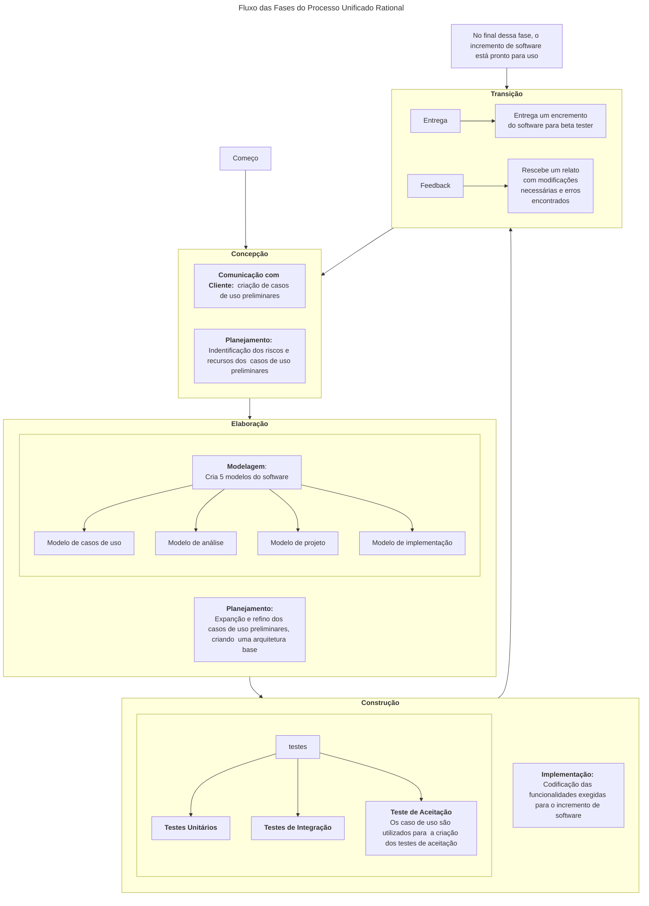

# Processo Unificado Rational

O processo Unificado é um processo de desenvolvimento **iterativo** e **incremental** de software constituído por 4 fases: [concepção](#concepção), [elaboração](#elaboração),
[construção](#construção), [transição](#transição).

## Concepção

Essa fase é responsável pela **comunicação com cliente** e **planejamento inicial**. Na comunicação com cliente são descritos os requisitos fundamentais em formato de casos de uso. No planejamento inicial é realizado uma analise de risco, identifica os principais recursos e cria um cronograma inicial para a entrega dos incrementos de software.

## Elaboração

Essa fase é responsável pelo **planejamento** e **Modelagem**. No planejamento da elaboração, é refinado e estendido os casos de uso feitos durante a [concepção](#concepção) e criado uma **arquitetura base** para o incremento de software. É feita 5 modelos sobre o software:

- Modelo de caso de uso
- Modelo de análise
- Modelo de projeto
- Modelo de implementação
- Modelo de entrega

## Construção

Essa fase é responsável pela **Codificação das funcionalidades** e **Testes** das funcionalidades que foram identificadas nos casos de uso. Na codificação será implementado as funcionalidades referentes ao incremento de software. Durante esse fase deverá ser feito **testes unidade** a medida que um componentes for finalizado. **Testes de integração** a medida que mais componentes forem finalizados. A implementação deverá passar nos **Testes de aceitação** criadas a partir dos casos de uso.

## Transição

Essa fase é responsável pelo **_deploy_** e **_feedback_**. Deploy significa que será enviado um incremento de software para usuários de teste beta e coletado o feedback como: defeitos e mudanças. Após as correções necessárias o incremento do software já poderá ser utilizado.

