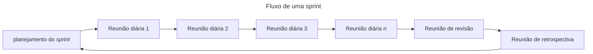

# Scrum

_Scrum_ é um framework leve que ajuda pessoas, times e organizações a gerar valor por meio de soluções adaptativas para problemas complexos. [scrum guide][guide]. O scrum determina um desenvolvimento incremental, onde cada iteração é chamada de _sprint_. Uma _sprint_ pode variar entre 3 a 4 semanas. O scrum pode ser entendido como um conjunto que contém dois principais artefatos: _Product_ _Backlog_ e _sprint_ _Backlog_, um time e quatro tipos de reuniões: reunião diária, reunião do planejamento da _sprint_, reunião de revisão do _sprint_ e reunião de retrospectiva do _sprint_.

## _Product_ _Backlog_

_Product_ _Backlog_ é uma lista **dinâmica** de requisitos ordenada em função da sua prioridade. Itens mais prioritários devem estar mais no topo da lista, portanto itens menos prioritários devem estar mais abaixo da lista. A qualquer momento um novo item pode ser adicionado no _Product_ _Backlog_

## _Sprint_ _Backlog_

_Sprint_ _Backlog_ é um subconjunto de itens retirados do _Product_ _Backlog_ que serão implementados na _sprint_. Uma vez selecionado os itens e começado uma _sprint_ **não é mais possível adicionar mais itens**.

## Time Scrum

Um time Scrum é composto por **um** _Product_ _Owner_, desenvolvedores ou time de desenvolvedores e **um** scrum _master_.

### _Product_ _Owner_

O _Product_ _Owner_ é a pessoa responsável por representar o cliente, sendo o cliente é aquele que paga pelo produto.

- **Apenas com a permissão do _Product_ _Owner_ pode-se adicionar novos itens no _Product_ _Backlog_.**
- **Apenas o _Product_ _Owner_ pode decidir se o incremento do produto está completo ou não.**
- **Apenas o _Product_ _Owner_ pode cancelar uma _sprint_ ou reiniciá-la.**

### Desenvolvedores

O número de desenvolvedores deve ser pequeno, entre 3 até 6 pessoas. Os desenvolvedores são uma equipe **auto-gerenciada**, ou seja, a equipe é quem decide como será feito o incremento do produto para cumprir a meta da _sprint_.

### Scrum _master_

O Scrum _master_ atua como facilitador, comanda as reuniões diárias e busca remover obstáculos identificados pelos membros do time durante a reunião. Ajuda o _Product_ _Owner_ a gerenciar os itens no _Backlog_ e garantir que os itens do _Backlog_ estão claros e coesos. O Scrum _master_ busca garantir que os desenvolvedores trabalhem uns com os outros para completar as tarefas.

## Reuniões do Scrum

Antes de toda _sprint_ começar é feita uma reunião de planejamento do _sprint_, durante a _sprint_ são feitas reuniões diárias e ao final de uma _sprint_ é feita uma reunião de revisão. Idealmente, após a reunião de revisão e antes de uma nova _sprint_ é realizada uma reunião de retrospectiva, mas não é obrigatório.

### Reunião de planejamento do _sprint_

Antes de começar a _sprint_ é feita uma reunião com todos os membros do time scrum visando desenvolver os itens do _Backlog_ do produto. O _Product_ _Owner_ e os desenvolvedores ordenam a lista de itens do _Backlog_ considerando as importância do item para o negócio do cliente, a complexidade da tarefa a ser realizada. O _Product_ _Owner_ estipula a meta da _sprint_ e os desenvolvedores junto com o scrum _master_ selecionam os itens para serem transferidos para o _Backlog_ do _sprint_. Os desenvolvedores determinam o que pode ser entregue ao final da janela de tempo alocada para a _sprint_. Lembrando que uma vez começado a _sprint_, não é possível mais adicionar itens ao _Backlog_ do _sprint_.

### Reuniões diárias

Durante uma _sprint_ é realizada uma reunião curta, idealmente de 15 minutos, comandada pelo scrum _master_, a qual os desenvolvedores também participam. Durante a reunião, todos os desenvolvedores geralmente respondem três perguntas:

- O que foi feito desde da última reunião ?
- Quais os obstáculos encontrados até o momento ?
- O que planeja realizar até a próxima reunião ?

A reunião não visa resolver problemas técnicos e sim socializar as informações sobre o processo de desenvolvimento e enunciar obstáculos que devem ser resolvidos pelo scrum _master_ até a próxima reunião.

### Reuniões de revisão

Ao final de uma _sprint_ é realizada uma reunião de revisão quando os desenvolvedores decidem que o incremento do produto está pronto. Todos do time scrum devem participar dessa reunião. O foco principal da reunião é uma demonstração do incremento do produto e sua avaliação.** Cabe ao _Product_ _Owner_ decidir se o incremento está ou não completo e sugerir mudanças e melhorias**. O _feedback_ é então utilizado para adicionar novos itens no _Backlog_ do produto. Idealmente essa reunião deve demorar 4 horas para uma _sprint_ de 4 semanas.

### Reuniões de retrospectiva de _sprint_

Idealmente, após a reunião de revisão e antes da reunião de planejamento do _sprint_ é realizada uma reunião com o objetivo de avaliar o processo de desenvolvimento. Geralmente a reunião visa responder três perguntas:

- O que deu certo na _sprint_ ?
- O que poderia melhorar ?
- O que a equipe se compromete a melhorar para o próximo _sprint_ ?

Todo o time scrum deve participar da reunião, sendo o scrum _master_ quem deve liderar a reunião.

[guide]: https://scrumguides.org/docs/scrumguide/v2020/2020-Scrum-Guide-PortugueseBR-3.0.pdf
