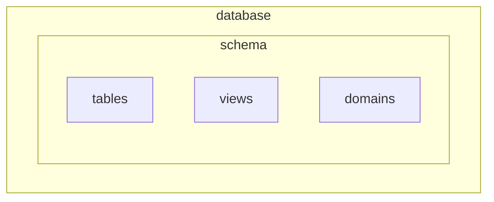

# O que é SQL ?

## SQL standard 1999: Data Definition Language (DDL)

1. `CREATE`: **Cria** objetos de um banco de dados, por exemplo: uma tabela
2. `DROP`: **Remove** objetos de um banco de dados, por exemplo: uma tabela
3. `TRUNCATE`: **Deleta** instancias de um objeto de um banco de dados relacional, por exemplo remove as linhas de uma tabela
4. `ALTER`: **Atualiza** ou **Altera** as propriedades de objeto de um banco de dados relacional, por exemplo adiciona ou remove uma nova coluna
5. `RENAME`: **Renomeia** objetos de um banco de dados, por exemplo renomeia uma tabela
6. `CHECK`: **Limita**  o intervalo de valores possíveis para uma coluna de uma tabela

## SQL standard 1999: Data Manipulation Language (DML)

1. `SELECT`
2. `INSERT`
3. `UPDATE`
4. `DELETE`

## SQL standard 1999: Data Transaction Language (DTL)

1. `COMMIT`
2. `ROLLBACK`

## SQL standard 1999: Data Control Language (DCL)

1. `GRANT`
2. `REVOKE`

## o que é um Schema ?

_Schema_ é um grupo de tabelas, tipos de dados, _constraints_ , _views_ , _domains_ , _authorization grants_ e outros elementos dentro de um mesmo _database_.
Em alguns sistemas de banco de dados relacional _schema_ é chamado de _database_.

