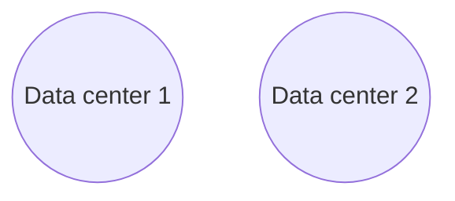
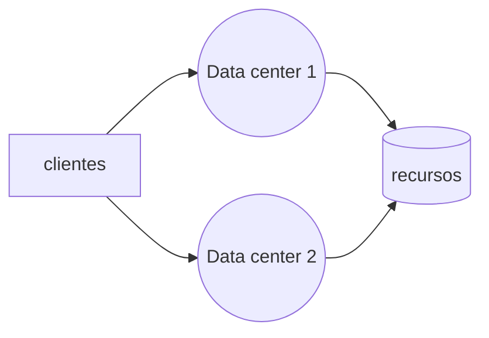
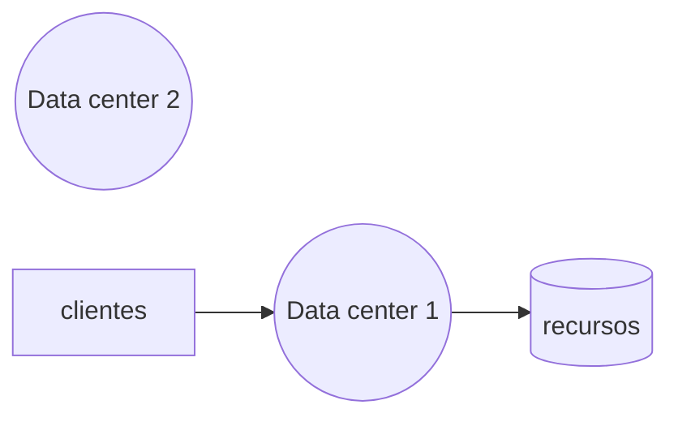

# Gestão de Continuidade de Negócio

<!--toc:start-->

- [Gestão de Continuidade de Negócio](#gestão-de-continuidade-de-negócio)
  - [ISO 27001](#iso-27001)
  - [ISO 2000](#iso-2000)
  - [ISO 2705](#iso-2705)
  - [ISO 27002](#iso-27002)
  - [ISO 22301: Segurança e Resiliência Sistema de Gestão de continuidade de negócios **Requisitos**](#iso-22301-segurança-e-resiliência-sistema-de-gestão-de-continuidade-de-negócios-requisitos)
    - [Continuidade de negócios](#continuidade-de-negócios)
    - [Plano de continuidade de negócios](#plano-de-continuidade-de-negócios)
    - [Disrupção](#disrupção)
    - [incidente](#incidente)
    - [impacto](#impacto)
    - [Contexto da Organização](#contexto-da-organização)
    - [Entendendo a Organização e seu contexto](#entendendo-a-organização-e-seu-contexto)
      - [Entendendo a Organização](#entendendo-a-organização)
      - [Entendendo as partes interessadas](#entendendo-as-partes-interessadas)
      - [Determinando o Sistema de Gestão de continuidade de negócio](#determinando-o-sistema-de-gestão-de-continuidade-de-negócio)
      - [Implementação do Sistema de Gestão de continuidade de negócio](#implementação-do-sistema-de-gestão-de-continuidade-de-negócio)
  - [Plano de Continuidade de Negócio (PCN)](#plano-de-continuidade-de-negócio-pcn)
    - [Plano de Contingência (Emergência) PC](#plano-de-contingência-emergência-pc)
    - [Plano de Administração de Crises - PAC](#plano-de-administração-de-crises---pac)
    - [Plano de recuperação de Desastres - PRD](#plano-de-recuperação-de-desastres---prd)
    - [Plano de Continuidade Operacional - PCO](#plano-de-continuidade-operacional---pco)
  - [Redundância de Data centers](#redundância-de-data-centers)
    - [Hot site](#hot-site)
    - [Cold site](#cold-site)
  - [Conceitos](#conceitos)

Toda aplicação possui dados e processos críticos as quais devem possui **Altos investimentos** para
preservação da informação e de ativos

## ISO 27001

Especifica os requisitos para estabelecer, implementar, manter e melhorar continuamente um sistema de gestão da segurança da informação dentro do contexto da organização. Esta Norma também inclui requisitos para a avaliação e tratamento de riscos de segurança da informação voltados para as necessidades da organização.

## ISO 2000

Publicada em 2013. **ISO 2000**. Ela especifica os requisitos para o provedor de serviço planejar, estabelecer, implementar, operar, monitorar, analisar criticamente, manter e melhorar um SGS. Os requisitos incluem o desenho, transição, entrega e melhoria dos serviços para cumprir os requisitos do serviço.

## ISO 2705

Publicada em 2011. **ISO 2705**. Este documento fornece diretrizes para o processo de gestão de riscos de segurança da informação.

## ISO 27002

Publicada em 2019. **ISO 27002**. Esta Norma fornece diretrizes para práticas de gestão de segurança da informação e normas de segurança da informação para as organizações, incluindo a seleção, a implementação e o gerenciamento de controles, levando em consideração os ambientes de risco da segurança da informação da organização. Publicada em 2013. A ISO 27002 visa não permitir a interrupção das atividades do negócio e proteger os processos críticos contra efeitos de
**falhas**, ou desastres significativos e assegurar a sua retomada em tempo hábil, se for o caso.

- A ISO 27002 define os **controles de segurança**
- A ISO 27001 define os **Requisitos do sistema de gestão**

## ISO 22301: Segurança e Resiliência Sistema de Gestão de continuidade de negócios **Requisitos**

Principais benefícios da norma na perspectiva:

- perspectiva do negócio:
  - apoia os seus objetivos estratégicos
  - cria vantagem competitiva
  - protege e melhora a sua reputação e credibilidade
  - contribui para a resiliência organizacional
- perspectiva financeira:
  - reduz a exposição legal e financeira
  - reduz custos diretos e indiretos de disrupções
- perspectiva de partes interessadas:
  - protege a vida, a propriedade e o meio ambiente
  - considera as expectativas das partes interessadas
  - fornece confiança na capacidade da organização de obter sucesso
- perspectiva de processos internos:
  - melhora a sua capacidade de permanecer eficaz durante as disrupções
  - demonstra controle proativo dos riscos de maneira efetiva e eficiente
  - endereça vulnerabilidades operacionais

### Continuidade de negócios

Capacidade de uma organização continuar a entra de produtos ou serviços, em um nível aceitável com capacidade predefinida durante uma disrupção

### Plano de continuidade de negócios

Informação documentada que orienta a organização a responder a uma disrupção e **retomar, recuperar e restaurar** a entrega de produtos e serviços
de acordo com os objetivos de continuidade de negócios

### Disrupção

incidente seja previsto ou imprevisto que causa um desvio não planejado e negativo da expectativa de entrega de produtos e serviços de acordo com
os objetivos da organização

### incidente

evento que pode representar ou levar á disrupção de negócios, perdas, emergências ou crises

### impacto

consequência de uma disrupção que afeta os objetivos

### Contexto da Organização

### Entendendo a Organização e seu contexto

#### Entendendo a Organização

A organização deve analisar as questões **externa** e **internas** que seja pertinentes para o seu propósito e que afetem sua capacidade de
alcançar o(s) resultado(s) pretendido(s) do seu sistema de gestão de continuidade de negócio (SGCN).

#### Entendendo as partes interessadas

A organização deve analisar as **necessidades e expectativas** das partes interessadas e requisitos **legais e regulamentares**.

#### Determinando o Sistema de Gestão de continuidade de negócio

Apos analisar o escopo: questões internas, externas, parte interessadas. A organização deve **determinar** o escopo do sistema
de gestão de continuidade de negócio. O escopo também deve ter missões, metas, indicadores que são de amplo conhecimento publico

#### Implementação do Sistema de Gestão de continuidade de negócio

Por fim a organização deve **estabelecer, implementar, manter e aprimorar continuamente** o SGCN, incluindo os processos necessários
e suas interações, de acordo com os requisitos deste documento.

## Plano de Continuidade de Negócio (PCN)

Desenvolvimento preventivo de um conjunto de estratégias e planos de ação de maneira a garantir que os serviços essenciais
**sejam devidamente identificados e preservados após a ocorrência de um desastre**, até o retorno á situação normal de funcionamento
da empresa dentro do contexto do negócio do qual faz parte. Cada PCN deve , coletivamente, conter:

- detalhes das ações que as equipes executarão, a fim de:
  - Continuar ou recuperar atividades priorizadas dentro de prazos predeterminados
  - monitorar o impacto da disrupção e a resposta da organização sobre ela
- referência aos limites predefinidos e processos para ativar o plano de resposta
- procedimentos para permitir a entrega de produtos e serviços na capacidade acordada
- detalhes para gerenciar as consequências imediatas de uma disrupção levando em consideração:
  - O bem-estar dos indivíduos
  - a prevenção de perda adicional ou indisponibilidade de atividades prioritárias
  - o impacto do ambiente

> O plano parte do principio de que **não se gerencia aquilo que não se identifica**.
> O PCN estabelece controles de segurança da informação com resultado de uma ampla análise de riscos.

> Deve-se possuir ações de auditoria e monitoramento do PCN. Teste periódicos para averiguar o resultado e performance.
> Idealmente o monitoramento deve ser continuo.

### Plano de Contingência (Emergência) PC

Deve ser utilizado em último caso, quando todas as prevenções tiverem falhado. Define as necessidades e ações mais imediatas.

### Plano de Administração de Crises - PAC

Define funções e responsabilidades das equipes envolvidas com o acionamento das ações de contingência, antes durante e após
a ocorrência.

### Plano de recuperação de Desastres - PRD

Determina o planejamento para que, uma vez controlada a contingência e passada a crise, a empresa retome seus níveis originais
de operação.

### Plano de Continuidade Operacional - PCO

Seu objetivo é reestabelecer o funcionamento dos principais ativos que suportam as operações de uma empresa, reduzindo o tempo
de queda e os impactos provocados por um eventual incidente. Um exemplo simples é a queda de conexão á internet.

## Redundância de Data centers

Imagine um cenário a qual se possui 2 data centers

### Hot site

Os dois _Data centers_ ficaram funcionando **ativamente** compartilhando recursos. No caso da falha de um,
não há qualquer prejuízo dos, inclusive na disponibilidade dos serviços qu estão sendo providos pelos _Data centers_.

### Cold site

Neste caso tem-se um outro ambiente com a infraestrutura necessária e suficiente para o reestabelecimento do
serviço sem o prejuízo das informações. Este novo ambiente está **inativo** e **não compartilha recursos** com
o ambiente original. Portanto em caso de falha do primeiro, tem-se um pequeno intervalo de indisponibilidade,
que seria o tempo necessário para "ligar" o novo _data center_ que já estava preparado.

## Conceitos

- BIA: Business Impact Analysis
- RTO: Recovery Time Objective
- RTA: Recovery Time Actual
- RPO: Recovery Point Objective
- MAO: Maximum Acceptable Outage ou MTPD: Maximum Tolerable Period of Disruption
- WRT: Work Recovery TIme
- MTTR: Mean Time TO Repair
- MTBF: Mean Time Between Failure

 [**Business Continuity Terminologies – RTO, RPO & MAO**][Business Continuity Terminologies – RTO, RPO & MAO]

[Business Continuity Terminologies – RTO, RPO & MAO]: https://www.theresilience.page/business-continuity-terminologies-rto-rpo-mao/
