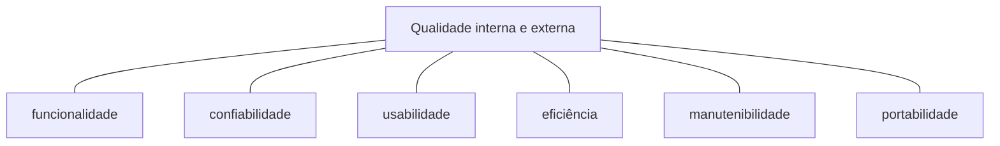
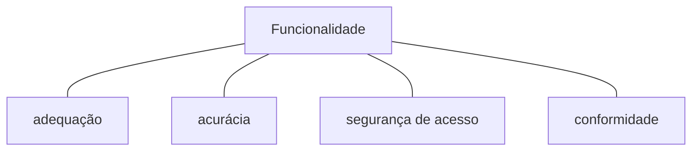
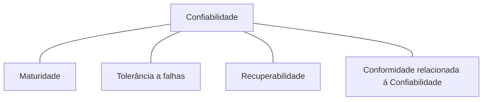
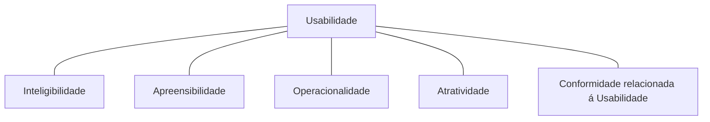
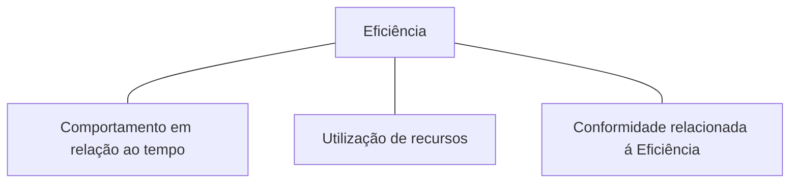
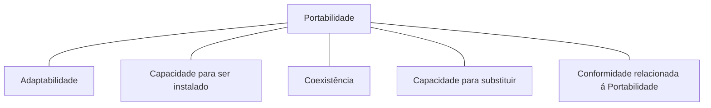
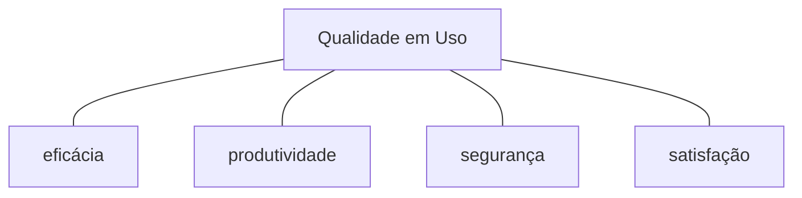

# Qualidades de software

- [Qualidades de software](#qualidades-de-software)
  - [Atividades para produção de um software de Qualidade](#atividades-para-produção-de-um-software-de-qualidade)
  - [Garantia de Qualidade e Controle de Qualidade](#garantia-de-qualidade-e-controle-de-qualidade)
  - [Verificação e Validação](#verificação-e-validação)
    - [Verificação](#verificação)
    - [Validação](#validação)
  - [ISO 9126](#iso-9126)
    - [Métricas de Qualidade de software](#métricas-de-qualidade-de-software)
    - [Qualidade Interna](#qualidade-interna)
    - [Qualidade Externa](#qualidade-externa)
      - [Funcionalidade (interna/Externa)](#funcionalidade-internaexterna)
        - [Adequação](#adequação)
        - [Acurácia](#acurácia)
        - [Segurança de Acesso](#segurança-de-acesso)
        - [Conformidade relacionada á funcionalidade](#conformidade-relacionada-á-funcionalidade)
      - [Confiabilidade (Interna e Externa)](#confiabilidade-interna-e-externa)
        - [Maturidade](#maturidade)
        - [Tolerância a falhas](#tolerância-a-falhas)
        - [Recuperabilidade](#recuperabilidade)
        - [Conformidade relacionada á Confiabilidade](#conformidade-relacionada-á-confiabilidade)
      - [Usabilidade (interna/ externa)](#usabilidade-interna-externa)
        - [Inteligibilidade](#inteligibilidade)
        - [Apreensibilidade](#apreensibilidade)
        - [Operacionalidade](#operacionalidade)
        - [Atratividade](#atratividade)
        - [Conformidade relacionada á Usabilidade](#conformidade-relacionada-á-usabilidade)
      - [Eficiência (Interna e externa)](#eficiência-interna-e-externa)
        - [Comportamento em relação ao tempo](#comportamento-em-relação-ao-tempo)
        - [Utilização de recursos](#utilização-de-recursos)
        - [Conformidade relacionada á Eficiência](#conformidade-relacionada-á-eficiência)
      - [Manutenibilidade (Interna ou Externa)](#manutenibilidade-interna-ou-externa)
        - [Analisabilidade](#analisabilidade)
        - [Modificabilidade](#modificabilidade)
        - [Estabilidade](#estabilidade)
        - [Testabilidade](#testabilidade)
        - [Conformidade relacionada a Manutenibilidade](#conformidade-relacionada-a-manutenibilidade)
      - [Portabilidade (Interna/Externa)](#portabilidade-internaexterna)
        - [Adaptabilidade](#adaptabilidade)
        - [Capacidade para ser Instalado](#capacidade-para-ser-instalado)
        - [Coexistência](#coexistência)
        - [Capacidade para substituir](#capacidade-para-substituir)
        - [Conformidade relacionada a Portabilidade](#conformidade-relacionada-a-portabilidade)
    - [Qualidade em uso](#qualidade-em-uso)
      - [Eficácia](#eficácia)
      - [Produtividade](#produtividade)
      - [Segurança](#segurança)
      - [Satisfação](#satisfação)

Qualidade de software pode ser definida como: _uma gestão de qualidade efetiva aplicada de modo a criar um produto útil que forneça_
_valor mensurável para aqueles que o produzem e para aqueles que o utilizam._ 
—Roger S. Pressman, Bruce R. Maxim, “Engenharia de software”, p. 312.
Portanto **Gerenciamento de qualidade de software** se preocupa em estabelecer padrões e
procedimentos para o desenvolvimento de software com qualidade. Algumas características de qualidade desejadas a um produto
são: interoperabilidade, Conformidade, tolerância a falhas, usabilidade.

- interoperabilidade: capacidade do produto interagir com outros sistemas.
- Conformidade: estar de acordo com normas, convenções, regulamentos previstos em lei, etc.
- tolerância a falhas: capacidade do produto manter os seus níveis de desempenho mesmo na presença de defeitos.
- Usabilidade: Capacidade do produto ser amigável e compreensível ao usuário.

## Atividades para produção de um software de Qualidade

Segundo PRESSMAN (Engenharia de Software. Uma Abordagem Profissional. 9º Edição. 2021) deve-se realizar **4** atividades
para produzir um software de qualidade:

- Utilizar processos e práticas comprovadas de **engenharia de software**
- Possuir um gerenciamento de projetos consistente
- Ter um controle de qualidade
- Possuir uma infraestrutura para garantir a qualidade

## Garantia de Qualidade e Controle de Qualidade

Com o objetivo de garantir qualidade de software duas atividades são bastante utilizadas: **Garantia de Qualidade** , **Controle de Qualidade**.
Garantia de qualidade é focada **no processo** de desenvolvimento de software e visa **prevenir** defeitos. O controle de qualidade é
focado **no produto** e visa **detectar** defeitos.

> Um exemplo de **Garantia de Qualidade** é a utilização de métodos ágeis que através de feedbacks mais frequentes aumenta a **garantia**
> de que um produto realmente esteja de atendendo o cliente.

> Um exemplo de **Controle de Qualidade** é a utilização de um _continuos integrator_ que pode **detectar** defeitos no software a cada
> novo incremento

## Verificação e Validação

A validação e verificação é um processo **continuo** no desenvolvimento de software, que possui dois objetivos:

- **Descobrir defeitos no sistema** (verificação)

- **avaliar se o sistema é útil e adequado em uma situação operacional** (validação)

Através desse processo buscamos aumentar o nível de **confiabilidade** do software.

### Verificação

> Are we building the product right ?  
> Estamos construído o produto de forma correta ?

Verificação refere-se ao conjunto de atividades que garantem que o software implementa corretamente as funções especificadas.
Uma atividade muito comum é a inspeção, como a revisão de código, ferramentas de analises sintáticas e testes, automatizados ou não,
que visam a verificar se o software atende as especificações.

### Validação

> Are we building the right product ?  
> Estamos construindo o produto certo ?

Validação refere-se ao conjunto de atividades que garantem que o software construído implementa o que o cliente realmente desejava.
Construindo especificações do sistema validados pelo cliente. Exemplo de atividades de validação são testes de aceitação, revisões
feitas pelos usuários.

## ISO 9126

ISO 9126 é uma norma versa sobre as características que definem um produto de software de qualidade. Ela é dividia em 4 partes:

- ISO 9126-1: Modelo de Qualidade
- ISO 9126-2: Métricas Externas
- ISO 9126-3: Métricas Internas
- ISO 9126-4: Métricas de Qualidade em Uso

O norma define três tipos de **visão** de qualidade mensuráveis: interna, externa e de uso. No entanto, a escola dessas métricas não foram definidas,
portanto subjetivas. Exemplo de escalas são:

- escalas binárias: Insatisfatório ou Satisfatório
- escalas discretas não binárias:
  - Ultrapassa os requisitos
  - No intervalo
  - Mínimo aceitável
  - inaceitável

### Métricas de Qualidade de software 

As métricas de qualidade de software são medidas **quantitativas** que são utilizadas para avaliar diversos aspectos do desenvolvimento, manutenção e desempenho do software. Elas fornecem uma maneira objetiva de avaliar a qualidade do software ao longo do ciclo de vida do projeto.
As métricas de qualidade podem ser aplicadas em diferentes áreas, incluindo código-fonte, processo de desenvolvimento, testes, desempenho e usabilidade. 
Tanto a qualidade externa e interna possui os mesmos sub tipos de qualidade: funcionalidade, confiabilidade, usabilidade, eficiência, manutenibilidade, portabilidade.

### Qualidade Interna

A qualidade Interna especifica o nível de qualidade sob o ponto de vista de produtos internos. Observa-se a qualidade dos produtos
intermediários como a qualidade dos modelos, código fonte, documentos e etc.

### Qualidade Externa

É entendido como qualidade externa todas as métricas retiradas do **software em execução**. Usualmente essas métricas são extraídas
durante uma simulação em um ambiente de testes com dados fictícios.

#### Funcionalidade (interna/Externa)

Funcionalidade é a capacidade de um software de prover funções que atendam ás necessidades do usuário, sejam essas
necessidades implícitas ou explícitas. A funcionalidade deve ser medida quando o software estiver sendo utilizado
sob condições especificas. Funcionalidade foi dividia em quatro sub características: adequação, acurácia, segurança
de acesso, conformidade relacionada á funcionalidade.

##### Adequação

Adequação é a capacidade do produto prover o conjunto apropriado de funções para tarefas e objetivos do usuário especificados.

##### Acurácia

Acurácia é capacidade do software prover, com o grau de precisão necessário resultados e efeitos corretos ou conforme acordados.

##### Segurança de Acesso

Segurança de Acesso é Capacidade do software proteger informações e dados tal que pessoas ou sistemas não autorizadas
não possam: ler, modificar ou apagar e que não seja negada as pessoas autorizadas o acesso ao sistema.

##### Conformidade relacionada á funcionalidade

Conformidade relacionada á funcionalidade é a capacidade do software estar conforme a lei, normas ou convenções relacionadas
a funcionalidade.

#### Confiabilidade (Interna e Externa)

Confiabilidade é a capacidade do software de manter um nível de desempenho quando usado em condições específicas.
Confiabilidade possui quatro subcaracterísticas: maturidade, tolerância a falhas, recuperabilidade, conformidade relacionada
á confiabilidade.

> Perceba que para mensurar confiabilidade tem que ter adequação, ou seja, dado que um software possui a funcionalidade
> desejada, o quão confiável ele é ?

##### Maturidade

Maturidade é a capacidade do software de evitar falhas decorrentes de feitos no software.

> O quão bugado esse software é ?

##### Tolerância a falhas

Tolerância a falhas é a capacidade do software de manter um nível de desempenho especificado em casos de defeitos no software
ou de violação de sua interface especificada.

##### Recuperabilidade

Recuperabilidade é a capacidade do software de restabelecer seu nível de desempenho especificado e recuperar os dados diretamente
afetados no caso de uma falha.

##### Conformidade relacionada á Confiabilidade

Conformidade relacionada á funcionalidade é a capacidade do software estar conforme a lei, normas ou convenções relacionadas
a confiabilidade.

#### Usabilidade (interna/ externa)

Usabilidade é a capacidade do software ser compreendido, aprendido, operado e atraente ao usuário.

##### Inteligibilidade

Inteligibilidade é a capacidade do software de possibilitar ao usuário compreender se o software é apropriado e como ele pode
ser usado para tarefas e condições de uso específicas.

##### Apreensibilidade

Apreensibilidade é a capacidade do software de possibilitar ao usuário aprender sua aplicação.

##### Operacionalidade

Operacionalidade é a capacidade do software possibilitar ao usuário operá-lo e controlá-lo.

##### Atratividade

Atratividade é a capacidade do software de ser atraente ao usuário.

##### Conformidade relacionada á Usabilidade

Conformidade relacionada á funcionalidade é a capacidade do software estar conforme a lei, normas ou convenções relacionadas
a usabilidade.

#### Eficiência (Interna e externa)

Eficiência é a capacidade do software de apresentar desempenho apropriado, relativo a quantidade de recursos usados.

##### Comportamento em relação ao tempo

Comportamento em relação ao tempo é a capacidade do software de fornecer tempos de resposta e de processamento, além
de taxas de transferência, apropriados, quando o software executa suas funções, sob condições estabelecidas.

##### Utilização de recursos

Utilização de recursos é a capacidade do software de usar tipos e quantidade apropriados de recursos, quando o software
executa suas funções sob condições estabelecidas.

##### Conformidade relacionada á Eficiência

Conformidade relacionada á funcionalidade é a capacidade do software estar conforme a lei, normas ou convenções relacionadas
a eficiência.

#### Manutenibilidade (Interna ou Externa)

Manutenibilidade é a capacidade do software de ser modificado. As modificações podem incluir correções, melhorias ou
adaptações devido a mudanças no ambiente e nos seus requisitos ou especificações funcionais.

##### Analisabilidade

Analisabilidade é a capacidade do software de permitir o diagnostico de deficiências ou causas de falhas no software,
ou a identificação de partes a serem modificadas.

##### Modificabilidade

Modificabilidade é a capacidade do software de permitir que uma modificação especificada seja implementada.

##### Estabilidade

Estabilidade é a capacidade do software de evitar efeitos inesperados decorrentes de modificações no software.

##### Testabilidade

Testabilidade é a capacidade do software de permitir que o software, quando modificado, seja validado.

##### Conformidade relacionada a Manutenibilidade

Conformidade relacionada á funcionalidade é a capacidade do software estar conforme a lei, normas ou convenções relacionadas
a manutenibilidade.

#### Portabilidade (Interna/Externa)

Portabilidade é a capacidade de software de ser transferido de um ambiente para outro.

##### Adaptabilidade

Adaptabilidade é a capacidade de um software de adaptado para diferentes ambientes especificados, sem necessidade de aplicação de
outras ações ou meios além daqueles fornecidos para essa finalidade pelo software.

##### Capacidade para ser Instalado

Capacidade para ser Instalado é a capacidade do software de ser instalado em um ambiente.

##### Coexistência

Coexistência é a capacidade do software coexistir com outros softwares independentes, em um ambiente comum, compartilhando recursos
comuns.

##### Capacidade para substituir

Capacidade para substituir é a capacidade do software de ser usado em substituição a outro produto de software especificado com o mesmo
propósito e no mesmo ambiente.

##### Conformidade relacionada a Portabilidade

Conformidade relacionada á funcionalidade é a capacidade do software estar conforme a lei, normas ou convenções relacionadas
a portabilidade.

### Qualidade em uso

A visão de qualidade do produto sobre a perspectiva do usuário medida quando o produto está rodando em produção.
A unidade de medida é o quanto o usuário está satisfeito, atendido com o produto. A qualidade em uso se divide
em quatro sub tipos: eficácia, produtividade, segurança, satisfação.

#### Eficácia

Eficácia é a capacidade do software de permitir que usuários atinjam metas especificadas com acurácia e completude, em um contexto de uso especificado.

#### Produtividade

Produtividade é a capacidade do software de permitir que seus usuários empreguem quantidade apropriada de recursos em relação á eficácia obtida, em um
contexto de uso especificado.

#### Segurança

Segurança é a capacidade do software de apresentar níveis aceitáveis de riscos de danos a pessoas negócios, software, propriedades e ao ambiente,
em um contexto de uso especificado.

#### Satisfação

Satisfação é a capacidade do software de satisfazer usuários, em um contexto de uso especificado.