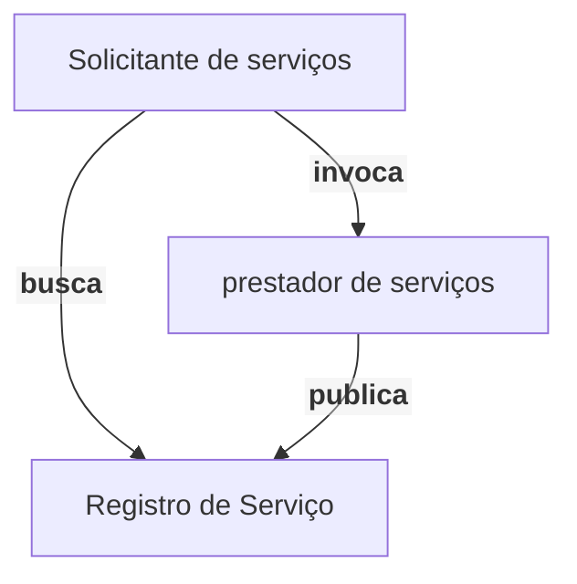

# Arquitetura Orientada a Serviços (Service-oriented architecture SOA)

<!--toc:start-->

- [Arquitetura Orientada a Serviços (Service-oriented architecture SOA)](#arquitetura-orientada-a-serviços-service-oriented-architecture-soa)
  - [Standardized Service Contract](#standardized-service-contract)
  - [Service Loose Coupling](#service-loose-coupling)
  - [Service Abstraction](#service-abstraction)
  - [Service Reusability](#service-reusability)
  - [Service Autonomy](#service-autonomy)
  - [Service Statelessness](#service-statelessness)
  - [Service Discoverability](#service-discoverability)
  - [Service Composability](#service-composability)
  - [Objetivos de uma Arquitetura Orientada a serviços](#objetivos-de-uma-arquitetura-orientada-a-serviços)
  - [Tipos de Serviço](#tipos-de-serviço)
    - [Serviços utilitários](#serviços-utilitários)
    - [Serviços de Negócio](#serviços-de-negócio)
    - [Serviço de Coordenação](#serviço-de-coordenação)
  - [Modelos de Arquitetura SOA](#modelos-de-arquitetura-soa)
    - [Modelo End-To-End](#modelo-end-to-end)
    - [Modelo Triangular](#modelo-triangular)
      - [Prestadores](#prestadores)
      - [Registro de serviço](#registro-de-serviço)
      - [Solicitante de serviço](#solicitante-de-serviço)
  - [Referências](#referências)

<!--toc:end-->

_Service-oriented architecture_ ou SOA é um estilo arquitetural que impõe uma organização e utilização
dos recursos distribuídos na forma de serviços fracamente acoplados. Cada serviço possui as seguintes
restrições:

- Standardized Service Contract
- Service Loose Coupling
- Service Abstraction
- Service Reusability
- Service Autonomy
- Service Statelessness
- Service Discoverability
- Service Composability

## Standardized Service Contract

Serviços **devem** compartilhar o mesmo contrato padronizado. Serviços que possuem a mesma funcionalidades devem respeitar a mesma interface.

## Service Loose Coupling

As interfaces dos serviços **devem** impor baixo acoplamento aos consumidores ao mesmo tempo que o serviços seja desacoplados do ambiente.

## Service Abstraction

Toda informação não essencial **deve** ser abstraída. Os contratos de serviço devem apenas conter informações essenciais
e toda informação sobre o serviço deve está contido no contrato.

## Service Reusability

Serviços **devem** ser capazes de se reutilizar. Serviços devem ser coesos, capazes de serem vistos como
**recursos reutilizáveis**

## Service Autonomy

Serviços **devem** ser autônomos. Serviços devem ser capazes de evoluir separadamente de outros serviços, ter o controle sobre
o seu ambiente de execução, permitindo usar essa informação com a finalidade de aprimorar sua performance.

## Service Statelessness

Serviços **devem** minimizar o armazenamento de estado, idealmente sem estado, com objetivo de reduzir o consumo de recursos.

## Service Discoverability

Serviços **devem** capazes de serem descobertos. Serviços **devem** ser complementados com meta dados que permitem ser descobertos
e interpretados.

## Service Composability

Serviços **devem** ser capazes de serem combináveis independentemente da complexidade dessa composição. Serviços serem capazes de se combinar e reutilizar é
justamente o principal atrativo dessa arquitetura, uma vez que ela é aplicada a organizações que possuem recursos altamente reutilizados, na suas soluções.

## Objetivos de uma Arquitetura Orientada a serviços

- interoperabilidade intrínseca: Os serviços já são naturalmente e nativamente interoperáveis
- federação: Ambiente de recursos e aplicativos conectados, porém com autonomia e autogestão
- Diversificação de fornecedores: É possível escolher o melhor fornecedor para o serviço que a organização precisa

## Tipos de Serviço

### Serviços utilitários

Implementam algum tipo de funcionalidade genérica que pode ser utilizada por várias aplicações

### Serviços de Negócio

Serviços associados a funcionalidades de negócio específicas: (Ex: matricular um aluno em um curso)

### Serviço de Coordenação

Serviços que coordenam um fluxo maior de outros serviços (ordenamento,gerenciamento de contexto, etc)

## Modelos de Arquitetura SOA

Existem diversos modelos de arquitetura SOA, desde de mais simples até mais complexos. O nível de sofisticação depende das necessidades da organização.

### Modelo End-To-End

O solicitante do serviço invoca diretamente o prestador do serviço. Portanto é necessário ter conhecimento prévio da existência do serviços

### Modelo Triangular

O modelo triangular envolve 3 atore: prestadores de serviço, solicitantes de serviço e registro de serviço.

#### Prestadores

Os prestadores publicam seus serviços no registro de serviço.

#### Registro de serviço

O registro de serviço recebe a solicitações de um prestador , que os organiza, cataloga e fornece alguma funcionalidade de busca para encontrar serviços.
O registro geralmente possui duas interfaces, uma para publicação e outra para busca.

#### Solicitante de serviço

Solicitante é todo cliente que deseja utilizar o serviço, nesse modelo o cliente recorre a interface de busca de um serviço e depois o invoca.

## Referências

[Erl, Thomas. Service-oriented architecture. Upper Saddle River: Pearson Education Incorporated, 1900.]({{site.github_assets}}/pdf/soa_book.pdf)
