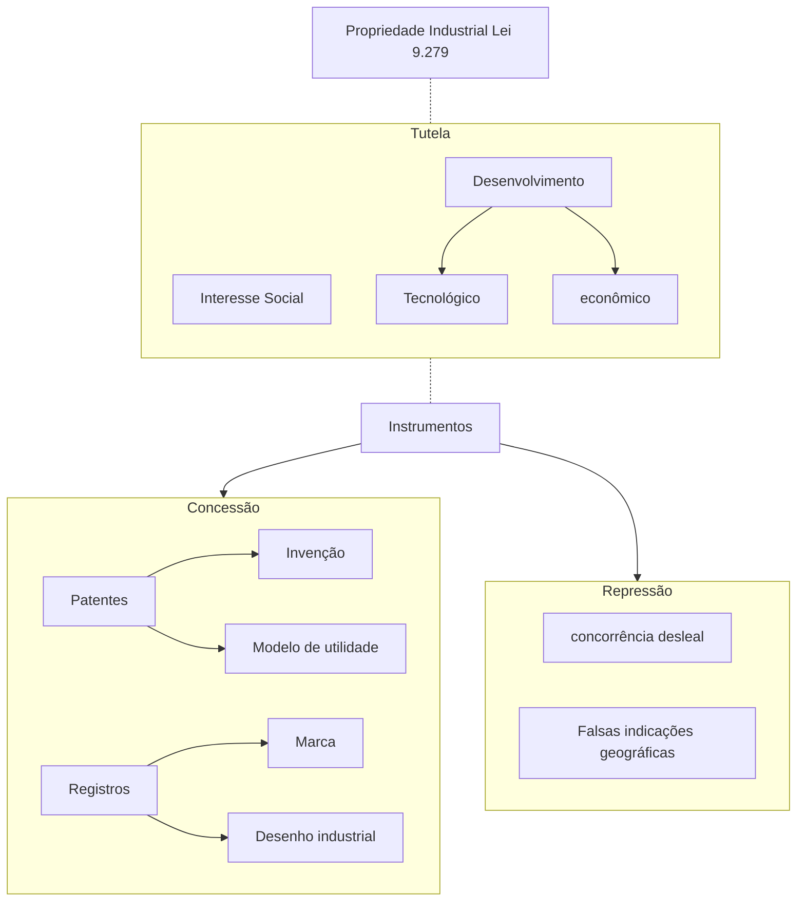
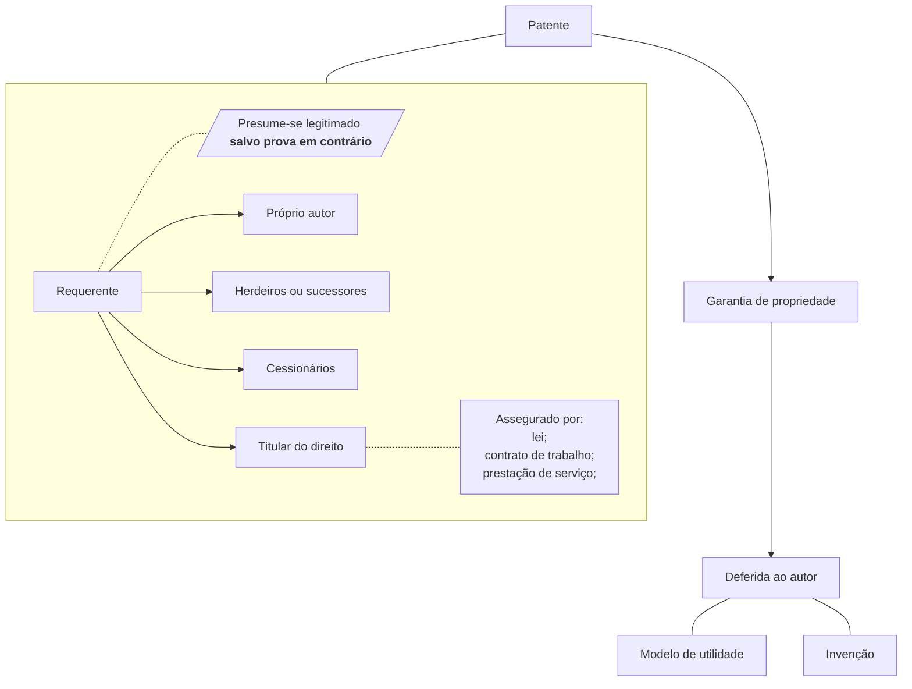
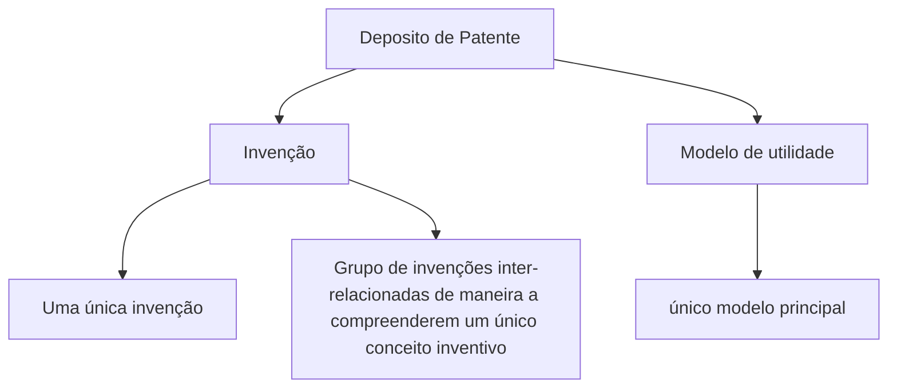
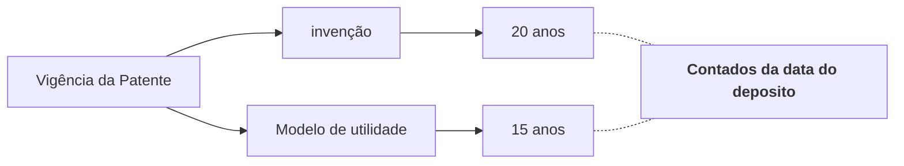

- [1. Propriedade Industrial](#1-propriedade-industrial)
  - [1.1. Modelos de utilidade](#11-modelos-de-utilidade)
  - [1.2. Os desenhos industriais](#12-os-desenhos-industriais)
  - [1.3. Registro de Marca](#13-registro-de-marca)
  - [1.4. Proteção dos direitos relativos a propriedade industrial](#14-proteção-dos-direitos-relativos-a-propriedade-industrial)
  - [1.5. Instituto Nacional da Propriedade Industrial INPI](#15-instituto-nacional-da-propriedade-industrial-inpi)
  - [1.6. Patentes](#16-patentes)
    - [1.6.1. Requisitos da Patente](#161-requisitos-da-patente)
      - [1.6.1.1. Invenção](#1611-invenção)
      - [1.6.1.2. Modelo de utilidade](#1612-modelo-de-utilidade)
      - [1.6.1.3. Novidade](#1613-novidade)
      - [1.6.1.4. Ato inventivo](#1614-ato-inventivo)
      - [1.6.1.5. Aplicação industrial](#1615-aplicação-industrial)
  - [1.7. Prioridade da Patente](#17-prioridade-da-patente)
  - [1.8. Não são invenções e nem modelo de Utilidade](#18-não-são-invenções-e-nem-modelo-de-utilidade)
    - [1.8.1. Não Patenteáveis](#181-não-patenteáveis)
      - [1.8.1.1. Definição de Microorganismos transgênicos para esta Lei](#1811-definição-de-microorganismos-transgênicos-para-esta-lei)
  - [1.9. Pedido de Patente](#19-pedido-de-patente)
  - [1.10. Exame do Pedido de Patente](#110-exame-do-pedido-de-patente)
  - [1.11. Concessão da Patente](#111-concessão-da-patente)
  - [1.12. Vigência da Patente](#112-vigência-da-patente)
  - [1.13. Proteção](#113-proteção)
  - [1.14. Nulidade da Patente](#114-nulidade-da-patente)
  - [1.15. Extinção da Patente](#115-extinção-da-patente)
  - [1.16. Empregado](#116-empregado)

# 1. Propriedade Industrial

Propriedade industrial decorre do que se chama propriedade intelectual.
Direito imaterial que se está ligado á atividade criativa do ser humano,
as criações humanas são protegidas pelo direito á propriedade intelectual que
tem uma divisão em **direito a propriedade industrial** e **direito autoral**.

- lei 9.279 (propriedade industrial)
- lei 9.610 (direito autoral)

Enquanto a direito a propriedade industrial protege uma técnica, o direito autoral protege a abora em si.
A lei 9.279 abrange:

- as patentes de invenção
- as patentes de modelo de utilidade
- o registro de desenho industrial e registro da marca

## 1.1. Modelos de utilidade

Os modelos de utilidade: são conhecidos no exterior como “patentes breves" ou “pequenas
patentes" que, em muitos países são protegidos por registro e não por patentes
como no Brasil, referem-se a certos tipos de invenções incrementais e
aperfeiçoamentos ou melhoramentos em ferramentas, equipamentos ou peças

## 1.2. Os desenhos industriais

Os desenhos industriais: a exclusividade dos
elementos ornamentais ou estéticos que possam ser aplicados a um produto,
proporcionando resultado visual novo e original com um caráter industrial pode
ser obtida através da proteção de desenhos industriais, em alguns países
designados por “patentes de desenho ou modelo". No Brasil, os desenhos
industriais são protegidos por meio de registro.

## 1.3. Registro de Marca

As marcas de produtos e serviços:
A proteção das marcas concede a exclusividade de sinais distintivos utilizados
para diferenciar os produtos e serviços de um empresário, bem como
diferenciá-los dos produtos e serviços de seus concorrentes.

## 1.4. Proteção dos direitos relativos a propriedade industrial

A Proteção dos direitos relativos a propriedade industrial, considerando o seu **interesse social** e **desenvolvimento
tecnológico e econômico** do país, efetua-se mediante:

1. concessão de patentes de invenção e de modelo de utilidade;
2. concessão de registro de desenho industrial;
3. concessão de registro de marca;
4. repressão as falsa indicações geográficas;
5. repressão á concorrência desleal

## 1.5. Instituto Nacional da Propriedade Industrial INPI

O INPI trata-se de uma **autarquia federal** criada pela lei 5.648 de 1970.
Este instituto é responsável por receber,analisar e conceder as questões relativas as patentes e aos registros.
Além de fazer a normas regulamentadoras sobre o assunto pertinente a propriedade industrial.

O INPI tem por finalidade principal, executar no âmbito nacional, as normas que regulam a propriedade industrial, tendo
em vista sua função **social**, **econômica**, **jurídica** e **técnica**, bem como pronunciar-se quando á conveniência de assinatura,
ratificação e denúncia de convenções, tratados, convênios e acordos sobre propriedade industrial.

## 1.6. Patentes

Patente é um direito de propriedade dado a quem fizer a invenção ou o modelo de utilidade desde que obtenha junto ao INPI essa patente,
então a propriedade da patente será assegurada ao autor ao cumprir as exigências legais para tal.
Existem dois tipos de técnicas: patentes de invenção e patentes de modelo de utilidade.

Ao autor de invenção ou modelo de utilidade será assegurado o direito de obter a patente que lhe garanta a propriedade,
nas condições estabelecidas nesta lei:

- **_Salvo prova em contrário, presume-se o requerente legitimado a obter a patente_**
- **_A patente poderá ser requerida em:_**
  - **_nome próprio;_**
  - **_pelo cessionário;_**
  - **_pelos herdeiros ou sucessores do autor;_**
  - **_a quem a lei ou o contrato de trabalho ou prestação de serviços determinar que pertença a titularidade_**;

No caso de dois ou mais autores tiverem realizado a mesma invenção ou modelo de utilidade, de forma independente,
o direito de obter patente será assegurando aquele que **provar o deposito mais antigo**, independentemente das datas
de invenção ou criação.

> Quem o inventor que protocolou deposito primeiro lava a patente. **independentemente de poder provar a data de criação da invenção, ou modelo de utilidade**

### 1.6.1. Requisitos da Patente

#### 1.6.1.1. Invenção

Para que uma invenção seja patenteável que tenha o requisito da **novidade**, da **atividade inventiva** e de **aplicação industrial**.
Os três requisitos precisam necessariamente ser atendidos. Portanto podemos concluir que invenção é algo original, criado por um **ser humano** e que
possa ser aplicado de maneira industrial.

#### 1.6.1.2. Modelo de utilidade

Para que um modelo de utilidade fique sujeito á patente. O modelo de utilidade deve ser é um **objeto de uso prático**, que possa ser **aplicado industrialmente**,
devendo ser **novo na forma ou na disposição**, seja considerado um **ato inventivo** e que apresente em uma **melhoria funcional**.

#### 1.6.1.3. Novidade

Novidade é algo que não está compreendido no estado da técnica. Estado da técnica quer dizer algo que já é de conhecimento publico.
Ao inventar alguma coisa, deve-se procurar o INPI e fazer o deposito do pedido de patente, pois se publicar em redes sociais, revistas
de renome, poderá caracterizar o estado da técnica e consequentemente a perda do requisito da novidade, portanto, da patenteabilidade.

- **_A invenção e o modelo de utilidade são considerados novos quando não compreendidos no estado da técnica_**

- **_O estado da técnica é constituído por tudo aquilo tornado acessível ao publico antes da data de deposito do pedido de patente,_**
  **_por descrição escrita, oral, por uso ou qualquer outro meio, no Brasil ou no exterior, ressalvando os disposto nos arts. 12, 16 e 17_**

Configura-se estado da técnica a partir da data do deposito, ou seja, qualquer pessoa que venha a pedir alguma patente igual a que já exista
um deposito não vai atender o requisito da novidade.

- **_para fins de aferição da novidade, o conteúdo completo de pedido depositado no Brasil, e ainda não publicado, será considerado estado_**
  **_da técnica a partir da data de deposito ou da prioridade reivindicada, desde que venha a ser publicado, mesmo que subseqüentemente._**

#### 1.6.1.4. Ato inventivo

Ato inventivo é um requisito que esta relacionado a algo que realmente decorre de ato humano, feito de maneira original por alguém e não pode
ser considerado como tal se for algo óbvio, evidente, comum e vulgar. Não pode ser confundido com uma descoberta. Uma formula matemática, por exemplo,
não pode ser considerada uma descoberta.

- **_A invenção é dotada de atividade inventiva sempre que, para um técnico no assunto, não decorra de maneira evidente ou óbvia do estado da técnica._**

- **_O modelo de utilidade é dotado de atividade inventiva sempre que, para um técnico no assunto, não decorra de maneira evidente ou óbvia do estado da técnica._**

#### 1.6.1.5. Aplicação industrial

O requisito da aplicação industrial consiste basicamente na utilidade prática do invento ou modelo de utilidade. Deve ser algo que possa ser utilizado industrialmente.

- **_A invenção ou modelo de utilidade são considerados suscetíveis de aplicação industrial quando possam ser utilizados ou produzidos em qualquer tipo de indústria._**

## 1.7. Prioridade da Patente

Mais de um deposito sobre a mesma invenção ou um mesmo modelo de utilidade. A prioridade é assegurada a quem depositou primeiro.
Quem fez o deposito em segundo momento pode sim acabar sendo o titulo da patente, nos casos em que o primeiro pedido
seja prejudicado por alguma questão legal. A prioridade pode ser assegurada mesmo em âmbito internacional, ou seja,
mesmo quando o deposito tiver sido feito em outro país desde de que o país tenha acordo com Brasil.

- **_Ao pedido de patente depositado em país que mantenha acordo com o Brasil, ou em organização internacional, que produza efeito de deposito nacional será_**
  **_assegurado direito de prioridade, nos prazos estabelecidos no acordo, não sendo o deposito invalidade nem prejudicado por fatos ocorridos nesses prazos_**

- **_ O pedido de patente de invenção ou modelo de utilidade depositado originalmente no Brasil, sem reivindicação de prioridade e não publicado, assegurará o_**
  **_direito de propriedade ao pedido posterior sobre a mesma matéria depositado no Brasil pelo mesmo requerente ou sucessores dentro do prazo de 1 ano_**

## 1.8. Não são invenções e nem modelo de Utilidade

1. Descobertas, teóricas cientificas e métodos matemáticos;
2. Concepções puramente abstratas;
3. Esquemas, planos, princípios ou métodos comerciais, contábeis, financeiros, educativos, publicitários, de sorteio e de fiscalização
4. Obras literárias, arquitetônicas, artísticas e científicas ou qualquer criação estética;
5. Programas de computador em si;
6. apresentação de informações;
7. regras de jogo;
8. técnicas e métodos operatórios ou cirúrgicos, bem como métodos terapêuticos ou de diagnóstico, para aplicação no corpo humano ou animal;
9. o todo ou parte de seres vivos naturais e materiais biológicos encontrados na natureza, ou ainda que dela isolados, inclusive o genoma ou germoplasma de qualquer ser vido natural e os processos biológicos naturais

### 1.8.1. Não Patenteáveis

1. O que for contrário á moral, aos bons costumes e á segurança, á ordem e á saúde públicas;
2. ~~as substâncias, matérias, misturas, elementos ou produtos de qualquer espécie bem como modificação~~
   ~~de suas propriedades físico-químicas e os respectivos processos de obtenção ou modificação,~~
   ~~quando resultantes de transformação do núcleo atômico;~~
   > A Lei anterior de propriedade intelectual não previa a possibilidade da concessão da patente de medicamentos, que somente foi
   > possível após assinatura do Acordo TRIPS que obrigou o Brasil e todos os signatários a alteraram sua legislação, para incorporar
   > ao seu ordenamento as normas do TRIPS.
   > Segundo o Art. 230,
   > LPI passou a ser possível ser depositado pedido de patente relativo às
   > substâncias, matérias ou produtos obtidos por meios ou processos químicos e as
   > substâncias, matérias, misturas ou produtos alimentícios, químico-farmacêuticos
   > e medicamentos de qualquer espécie, bem como os respectivos processos de
   > obtenção ou modificação, por quem tenha proteção garantida em tratado ou
   > convenção em vigor no Brasil, ficando assegurada a data do primeiro depósito no
   > exterior, desde que seu objeto não tenha sido colocado em qualquer mercado, por
   > iniciativa direta do titular ou por terceiro com seu consentimento, nem tenham
   > sido realizados, por terceiros, no País, sérios e efetivos preparativos para a
   > exploração do objeto do pedido ou da patente.
3. Todo ou parte dos seres vivos, exceto os microorganismos transgênicos que atendam aos três requisitos de patenteabilidade e que não seam mera descoberta.

#### 1.8.1.1. Definição de Microorganismos transgênicos para esta Lei

Microorganismos transgênicos são organismos que expressem mediante intervenção humana direta em sua composição genética, uma característica normalmente não alcançável
pela espécie em condições naturais.

## 1.9. Pedido de Patente

O pedido de patente, nas condições estabelecidas pelo INPI conterá:

1. requerimento;
2. relatório descritivo;
3. reivindicações;
4. desenho, se for o caso;
5. resumo;
6. comprovante de pagamento da retribuição relativa ao deposito;

Apresentado o pedido, será ele submetido a exame formal preliminar e, se devidamente instruído, será protocolizado, considerada a data de deposito a da sua apresentação.

Cada pedido de patente dever feito para uma única invenção ou até por ser para um grupo de invenções que estejam relacionadas de maneira a comporem um único conceito inventivo.
A mesma regra de unidade aplica-se ao pedido de patente de modelo de utilidade.

- **_O pedido de patente terá de se referir a uma única invenção ou um grupo de invenções inter-relacionadas de maneira a compreenderem um único conceito inventivo_**

- **_O pedido de patente de modelo de utilidade terá de se referir a um único modelo principal, que poderá incluir uma pluralidade de elementos distintos,_**
  **_adicionais ou variantes construtivas ou configurativas, desde que mantida a unidade técnico funcional e corporal do objeto._**

## 1.10. Exame do Pedido de Patente

Sigilo de 18 meses. O pedido de patente será mantida em sigilo durante 18 meses contados a partir da data do deposito ou da prioridade mais antiga, quando houver.
O INPI publicará, ou seja, tornar a patente publica após esse período, exceto quando for o caso do art. 75.

## 1.11. Concessão da Patente

A patente será concedida depois de deferido o pedido e comprovado o pagamento da retribuição correspondente, expedindo-se a respectiva carta-patente.

- **_O pagamento da retribuição e respectiva comprovação deverão ser efetuadas no prazo de 60 dias contados do deferimento._**

## 1.12. Vigência da Patente

A lei concede um prazo para a exploração do invento por meio da patente. É o chamado **prazo de vigência** da patente que é de 20 anos para a invenção
e 15 anos para o modelo de utilidade. Note que o início da contagem desse prazo é feito da **data do deposito e não da data da concessão** da patente.

- **_A patente de invenção vigorará pelo prazo de 20 anos e o de modelo de utilidade pelo prazo de 15 anos contados da data de deposito_**

## 1.13. Proteção

O titular da patente possui o direito de exploração econômica exclusivo. Impedir que terceiros produzam, usem, vendam
ou importem produtos objeto da patente ou façam essas coisas no processo ou produto obtido diretamente pelo processo
patenteado.

- **_A patente confere ao seu titular o direito de impedir terceiro, sem o seu consentimento de produzir, usar, colocar á venda,_**
  **_vender ou importar com estes propósitos:_**

  1. produto objeto de patente;
  2. processo ou produto obtido diretamente por processo patenteado;

- **_Ao titular da patente é assegurado ainda o direito de impedir que terceiros contribuam para que outros pratiquem os atos referidos neste artigo_**.

- **_Ao titular da patente é assegurado o direito de obter indenização pela exploração indevida de seu objeto, inclusive em relação á exploração_**
  **_indevida de seu objeto, inclusive em relação á exploração ocorrida entre a data da publicação e a da concessão da patente_**.

## 1.14. Nulidade da Patente

- **_É nula a patente concedida contrariando as disposições desta Lei_**.
- **_A nulidade da patente produzirá efeitos a partir da data do depósito do pedido_**

## 1.15. Extinção da Patente

A patente extingue-se:

- pela expiração do prazo de vigência;
- pela renúncia de seu titular, ressalvado o direito de terceiros;
- pela caducidade;
- pela falta de pagamento da retribuição anual, nos prazos previstos;
- pela inobservância do disposto art 217;

- **_Art. 217 A pessoa domiciliada no exterior deverá constituir e manter procurador devidamente qualificado_**
  **_e domiciliado no País, com poderes para representá-la administrativa e judicialmente, inclusive para receber citações_**

- **_A renúncia só será admitida se não prejudicar direitos de terceiros_**

- **_Caducará a patente, de oficio ou a requerimento de qualquer pessoa com legítimo interesse, se, decorridos 2 anos da_**
  **_concessão da primeira licença compulsória, esse prazo não tiver sido suficiente para prevenir ou sanar o abuso ou desuso,_**
  **_Salvo motivos justificáveis_**

## 1.16. Empregado

A invenção e o modelo de utilidade pertencem **exclusivamente** ao empregador quando decorrerem de contrato de trabalho cuja execução ocorra no Brasil
e que tenha por objeto a pesquisa ou atividade inventiva, ou resulte esta da natureza dos serviços para os quais foi empregado contratado.

- **_Salvo expressa disposição contratual em contrário, a retribuição pelo trabalho que se refere este artigo limita-se ao salário ajustado._**

- **_Salvo prova em contrário, consideram-se desenvolvidos na vigência do contrato a invenção ou o modelo de utilidade,_**
  **_cuja patente seja requerida pelo empregado até 1 após a extinção do vinculo empregatício_**.

- **_O empregador, titular da patente, poderá conceder ao empregado, autor de invento ou aperfeiçoamento, participação nos ganhos econômicos resultantes_**
  **_da exploração da patente, mediante negociação com o interessado ou conforme disposto em norma da empresa_**
