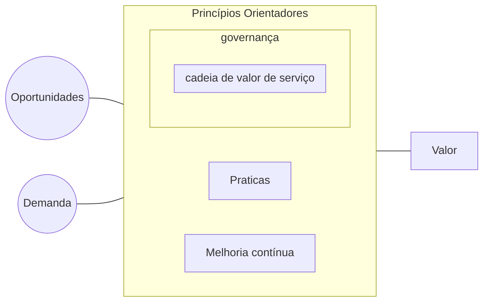

# Resumo ITIL versão 4: Sistema de Valor de Serviço

Para o gerenciamento de serviço funcionar corretamente, ele precisa trabalhar como um **sistema**.
O sistema de Valor de Serviço (SVS) Descreve **como os componentes e atividades da organização trabalham juntos** como um sistema:

- Entradas: oportunidade e demanda
- Saídas: criação de valor
- Componentes: governança, princípios, práticas, melhoria contínua de valor de serviço

## Oportunidade e Demanada

Oportunidade e Demanda acionam atividades dentro do SVS que levam a criação de valor.

- Nem toda oportunidade é explorada e nem todademanda é atendida

Oportunidade **é a possibilidade de gerar valor** ou melhorar a organização

Demanda representa a **necessidade ou desejo por produtos e serviços** de clientes internos ou externos

## Princípios Orientadores

- Princípio Orientador: **uma recomendação que guia a organização em todas as circunstâncias**.

- São independentes de mudanças na Estratégia, metas ou tipos de estruturas de gerenciamento.

- Um princípio orientador é **universal e duradouro**

- Ao todo são 7 príncípios Orientatores:

1. Foque no valor
2. comece onde você está
3. progrida iterativamente com feedback
4. Colabore e promova visibilidade
5. Pense e trabalhe de forma holística
6. matenha simplicidade e praticidade
7. Otimize e Automatize

### Foque no valor

É necessário mapear aquilo que realmente interessa ao seus clientes

- Tudo que a organização precisa mapear para **criar valor para as partes interessadas**.

- Engloba muitas perspectivas, incluíndo a experiência de clientes e usuários.

### Comece onde você está

- Não comece do zero, sem antes considerar o que pode ser aproveitado na organização.

- O estado atual deve ser investigado e completamente entendido.

### Progrida iterativamente com feedback

- Não faça tudo ao mesmo tempo
- Organize o trabalho em seções menores e mais facilmente gerenciávies
- Utilize feedback em cada etapa do processo

### Colabore e promova a visibilidade

- **Trabalhar em parceria produz melhores resultados** e sucesso de longo prazo
- O trabalho deve ser transparente e as informações devem ser mais visiveis possível

### Pense e trabalhe de forma holística

- Considere o serviço como um todo, e não apenas suas partes isoladas
- Integre  tecnologia, informações, pessoas, organizações, parceiros, acordos. Tudo deve ser coordenados

### Mantenha a simplicidade e praticidade

- Se o processo, serviço, ação ou métrica não produzir nenhum valor, elimine-o
- Use o menor número de passos possível para completar uma tarefa

### Otimize e automatize

- Recursos de todos os tipos, principalmente de RH, devem ser usadas da melhor forma
- Elimine tudo que for desperdício e use tecnologia sempre que possível

## Governança

Governança: Meio pelo qual uma organização é dirigida e controlada

Toda organização é governada por alguma estrutura, como o Corpo de Diretores ou Gerentes Executivos

A estrutura de governança é responsável pela conformidade da organização com políticas e regulamentos externos

### Atividades da governança

#### Avaliar

- Avaliar busca responder a pergunta: **Ontes estamos ?**

- Cobre a avaliação da organização sua estratégia, portflólio e relacionamento com outras partes.

#### Dirigir

- Dirigir busca responder a pergunta: **Para onde vamos ?**

- Definir estratégias para a direção, priorização, atividades e investimentos da organização

- As políticas definem um conjunto de regras de comportamento na organização

#### Monitorar

- Monitorar busca responder a pergunta: **Chegamos lá ?**

- Envolve o **monitoramento do desempenho da organização** e suas práticas, produtos e serviços.
