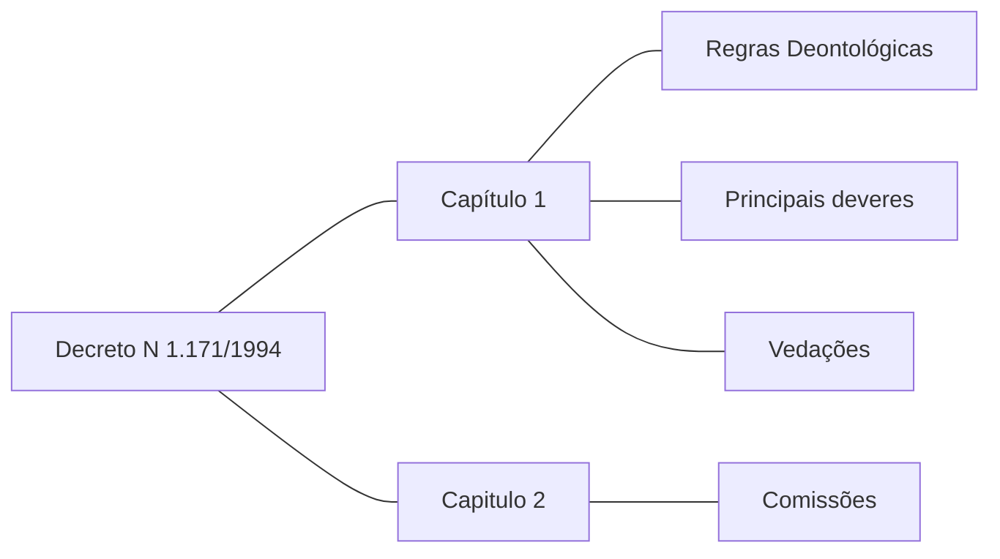
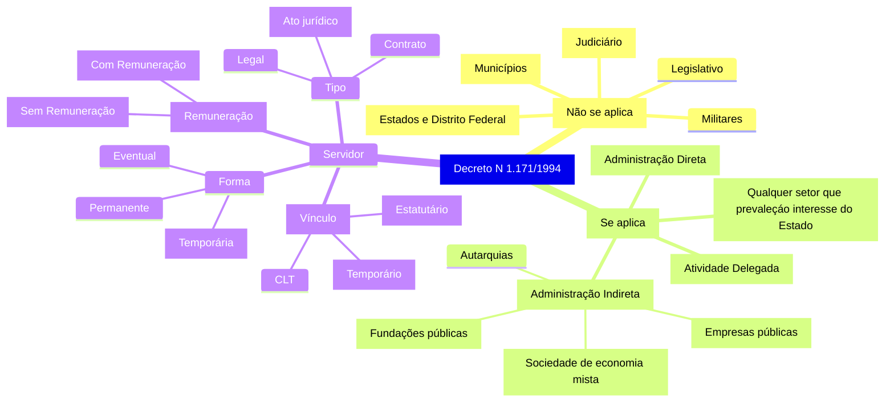
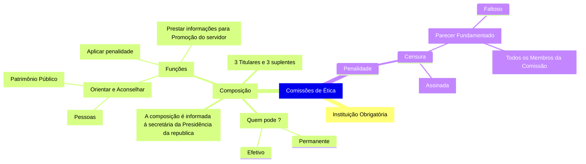
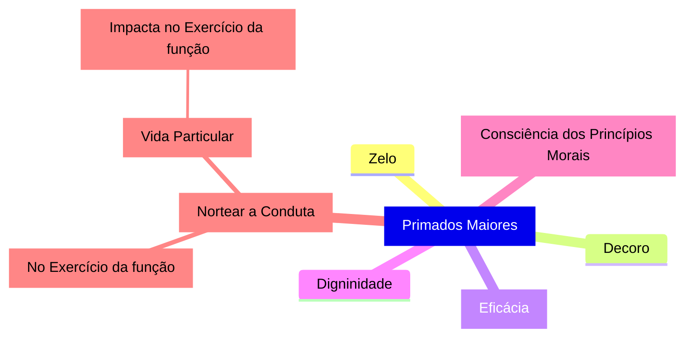
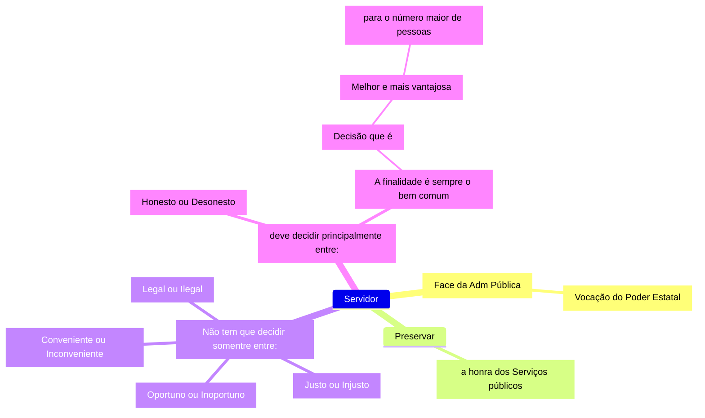
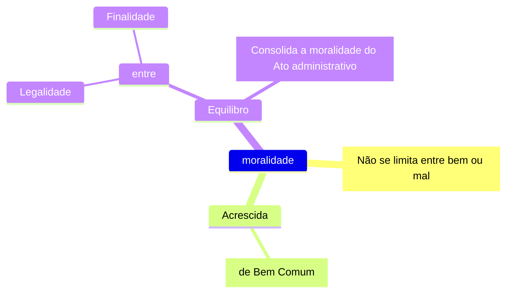
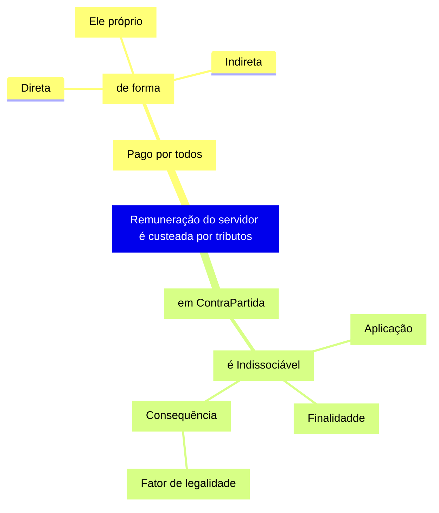
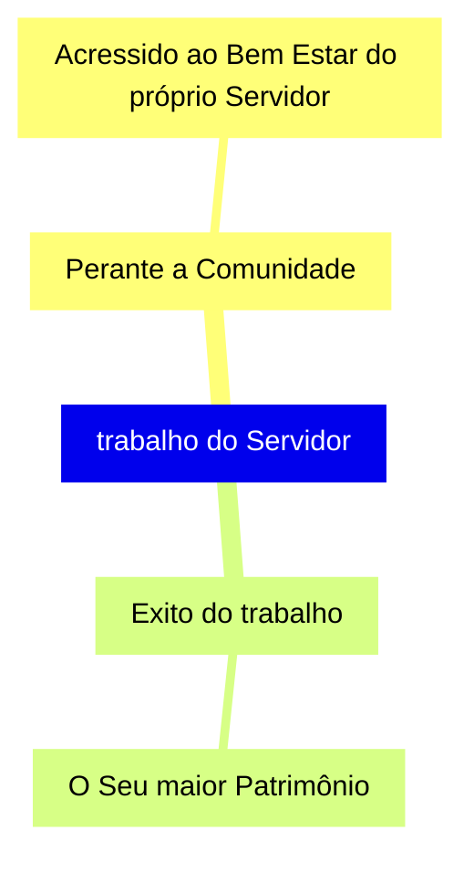
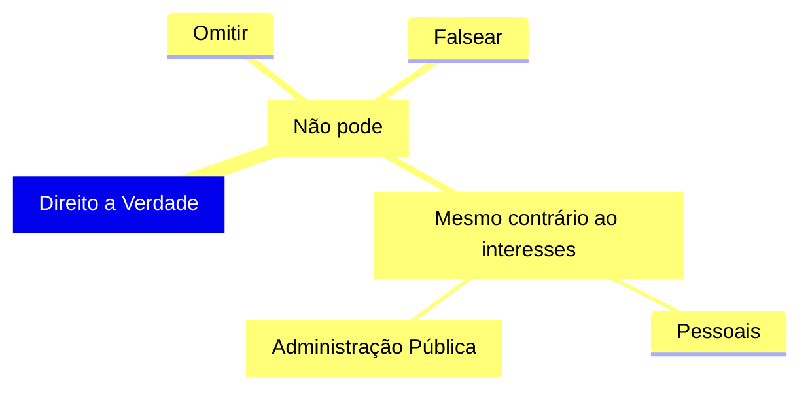
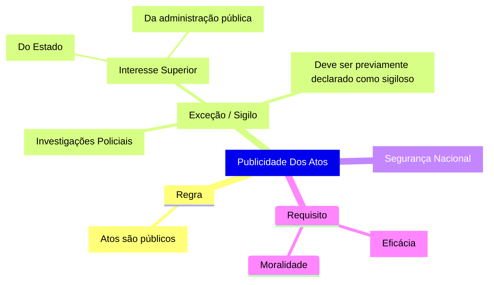

# Decreto N. 1.171/1994: Código de Ética Profissional do Servidor Público Civil no Poder Executivo Federal

**O PRESIDENTE DA REPÚBLICA**, no uso das atribuições que lhe confere o art. 84, incisos IV e VI, e ainda tendo em vista o disposto no art. 37 da Constituição, bem como nos arts. 116 e 117 da Lei n° 8.112, de 11 de dezembro de 1990, e nos arts. 10, 11 e 12 da Lei n° 8.429, de 2 de junho de 1992,

DECRETA:

- Art. 1° Fica aprovado o Código de Ética Profissional do Servidor Público Civil do Poder Executivo Federal, que com este baixa.

- Art. 2° Os órgãos e entidades da Administração Pública Federal direta e indireta implementarão, em sessenta dias, as providências necessárias à plena vigência do Código de Ética, inclusive mediante a Constituição da respectiva Comissão de Ética, integrada por três servidores ou empregados titulares de cargo efetivo ou emprego permanente.

- Parágrafo único. A constituição da Comissão de Ética será comunicada à Secretaria da Administração Federal da Presidência da República, com a indicação dos respectivos membros titulares e suplentes.

- Art. 3° Este decreto entra em vigor na data de sua publicação.

## Disposições Gerais

## Aplicação do código de ética

Se aplica o Decreto N. 1.171/1994 em atividades do **Poder Executivo Federal** ao seus **Servidores públicos Civis**, pontando a lei se aplica em:

- Na administração direta
- Na administração indireta:
  - Fundações pública
  - Empresas públicas
  - Sociedade de economia mista
  - Autarquias

**Não** se aplica o Decreto N. 1.171/1994:

- Militares
- Servidores do Judiciário
- Servidores do Legislativo
- Estados e Distrito Federal
- Municípios

Um servidor público civil pode ter vinculo estatutário (Regido pela 8.112), empregado (Regido pela CLT) ou temporário. Sendo ele remunerado ou não.

## Comissões de Ética

Em todos os órgãos e entidades da Administração Pública Federal direta, indireta, autárquia e fundacional, ou em qualquer órgão ou entidade que exerça atribuições delegadas pelo
poder público, deverá ser criada uma comissão de Ética encarregada de orientar e aconselhar sobre a ética profissional do servidor, no tratamento com as pessoas e com o patrimônio
público, competindo-lhe conhecer concretamente da imputação ou de procedimento susceptível de censura.

## Regras Deontológicas

## Servidor

## Moralidade

## Remuneração do servidor é custeada por tributos

## Trabalho do servidor

## Direito a verdade

## Publicidade dos atos

