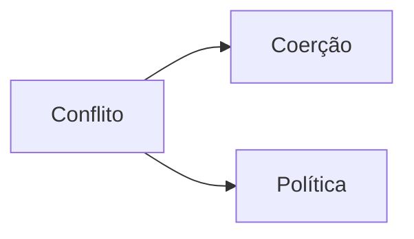
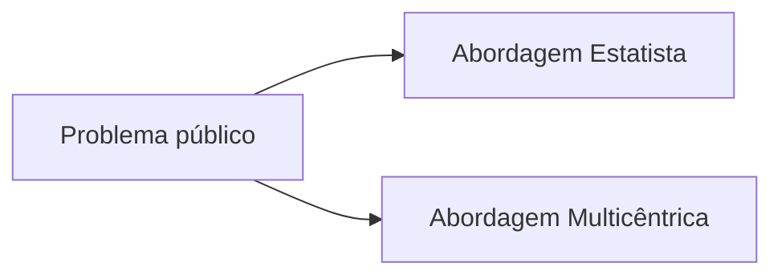
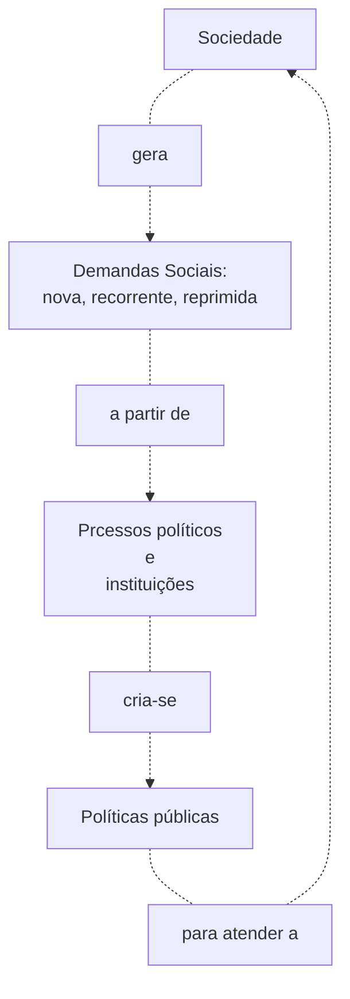

# Politica Pública

Um conflito pode ser resolvido ou através coerção ou através da política. Política é a arte de influenciar, manipular ou controlar grupos com a intenção de avançar os propósitos
de alguns contra a oposição de outros. São procedimentos que visam permitir a convivência entre diferentes.

Portanto política pública é toda atividade política orientada para a coletividade e para o interesse público.

> Política públicas são: ações, decisões, metas, objetivos e procedimentos governamentais que atingem, influenciam, regulamentam, alterando o comportamento dos indivíduos na
> sociedade, com o objetivo de alcançar o bem comum
> **_(Lowi, 1936)_**

## Abordagens da Política Pública

As políticas públicas podem ser definidas a partir dos atores governamentais, ou não. É chamado de **Abordagem Estatista**
Quando a gestão das políticas públicas é algo estritamente relacionado aos atores governamentais, portanto o Estado detém o monopólio para fazer. Na **Abordagem Multicêntricas**
a gestão permite a existência de outros atores como: organizações privadas, organizações não governamentais( ONGs) e esses atores junto com os atores governamentais formulam e
implementam as políticas públicas.

## Dimensões da Política Pública

A política diferencia três dimensões entrelaçadas.

- **Dimensão institucional**: delineia o sistema jurídico (conjunto de normas) e sua estrutura do sistema político-administrativo
- **Dimensão processual**: delineia o processo político (atividade política) relacionada a imposição de objetivos
- **Dimensão material**: delineia o conteúdo, de interesse público, concreto da política

## Tipos de Demandas que geram Políticas Públicas

A atividade política dos governos se destina a satisfazer demandas que geram processos formais e informais de resolução de interesses. Existem três tipos de demandas:
**demandas novas**, **demandas reprimidas** e **demandas recorrentes**. É chamado **Demandas novas** quando o conflito é resultante de novos atores ou novos problemas.
**Demandas recorrentes** são problemas mal resolvidos ou que não formam resolvidos. **Demandas reprimidas** são constituídas por não decisões e não são reconhecidas como
problemas.

## Tipos de Política Pública

Existem dois tipos de política pública: políticas de estado e políticas governamentais.

- **Políticas de Estado**: especificadas na Constituição Federal, não restam aos atores políticos a possibilidade de disputa de espaços se não o seu comprimento;

- **Políticas Governamentais**: são empreendidas por atores governamentais e emanadas pelos Poderes de Estado.

## Componentes das Políticas Públicas

Toda política pública contém os seguintes componentes:

- **Componente institucional**: é elaborada ou decidida por autoridade formal
- **Componente decisório**: é um processo de escolha de meios e fins, de curto ou longo prazo, para atender demandas
- **Componente comportamental**: implica uma ação ou inação, fazer ou não fazer
- **Componente causal**: são produtos de ações que tem efeito no sistema político e nas demandas da sociedade
