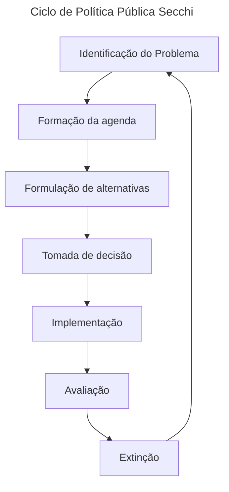
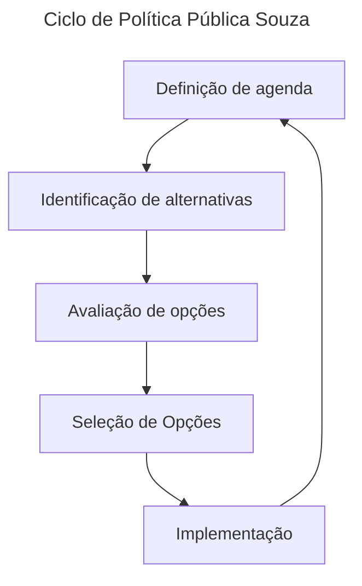
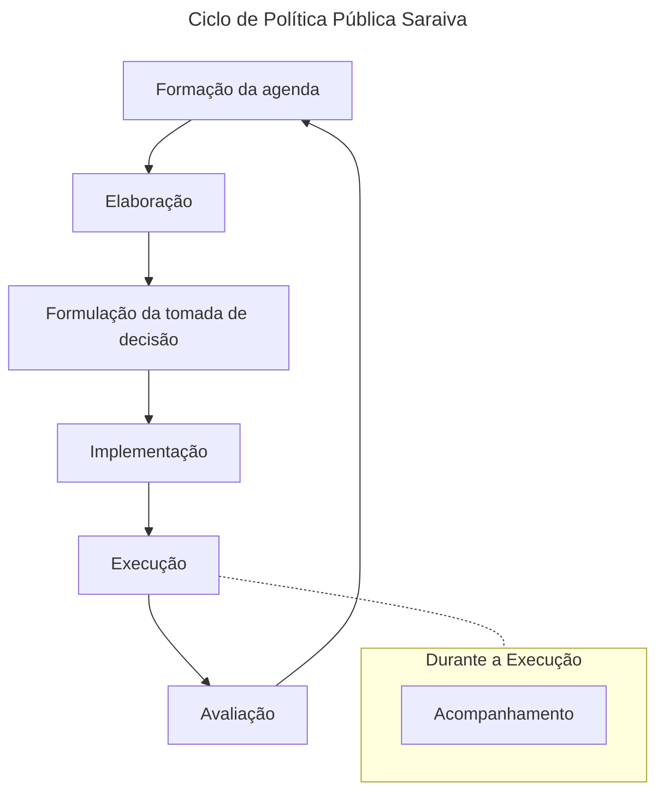
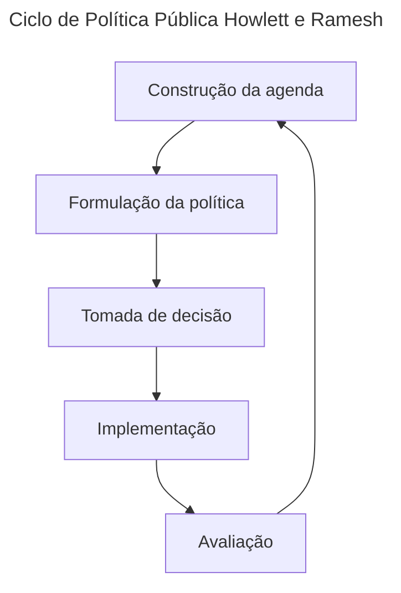

# Ciclo de Política Públicas

O ciclo de políticas pública é um esquema de visualização e interpretação que organiza a vida de uma política pública em fases. As fases podem ser sequenciais, interdependentes,
se misturarem, ficarem sobrepostas ou serem diferentes.

## Fase: Construção, formação, definição da agenda

A agenda consiste numa lista de temas ou problemas que são alvo de atenção em dado momento. Nessa fase busca-se identificar os **problemas coletivos** que podem ser resolvidos com
políticas públicas. O processo envolve diversos grupos de interesse que buscam que suas demandas sejam incluídas na agenda, especialmente incluídas como um problema e não como
situação. **Situação** é algo que não ocupa lugar prioritário na agenda, já um **problema** é algo que muito provavelmente terá prioridade na agenda. Portanto a construção da
agenda é um processo **competitivo**.

> O autor [Secchi](#secchi) divide o momento em que busca-se identificar o problemas coletivos da construção da agenda.

### Condições para um problema entrar na agenda

Para um problema entrar na agenda ele deve ter:

- **Atenção**: Diferentes atores (cidadãos, grupos de interesse, mídia e etc) devem entender a **situação como merecedora de intervenção**
- **Resolutividade**: As possíveis ações para resolver o problema devem ser consideradas **necessárias e factíveis**
- **Competência**: O problema deve estar relacionado a uma **responsabilidade pública**

## Secchi

## Souza

## Saraiva

## Howlett e Ramesh

