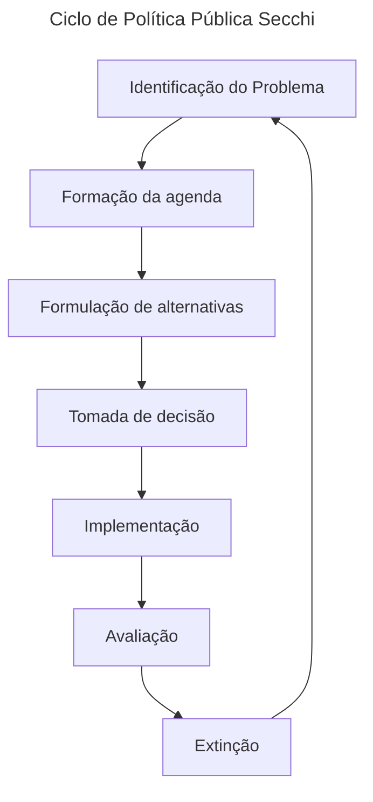
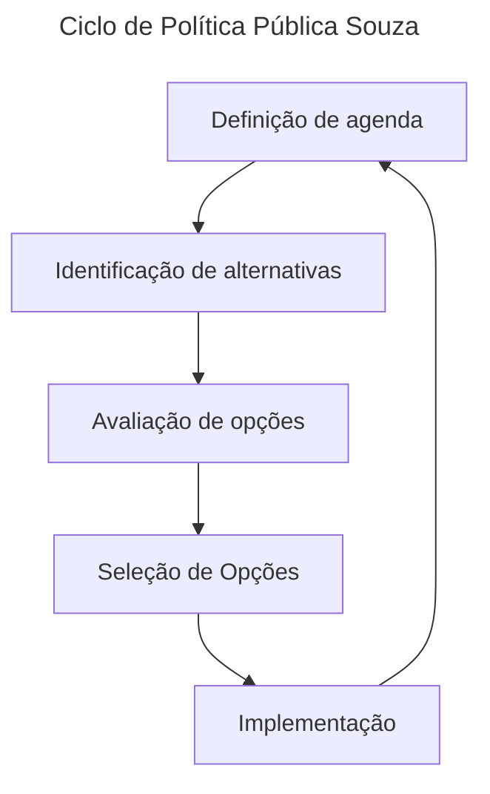
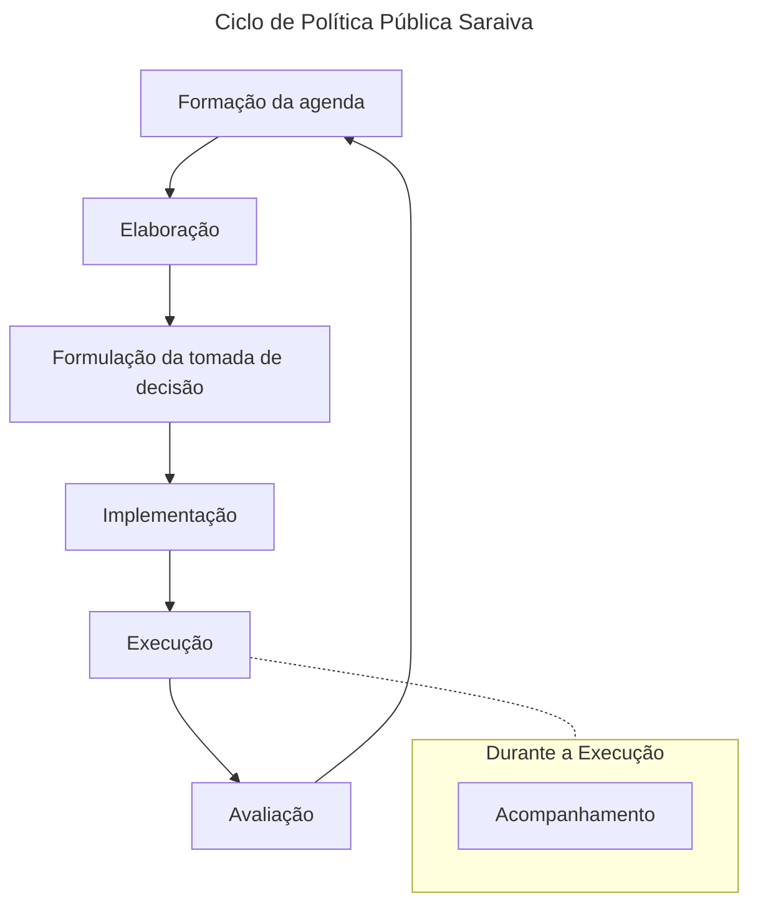
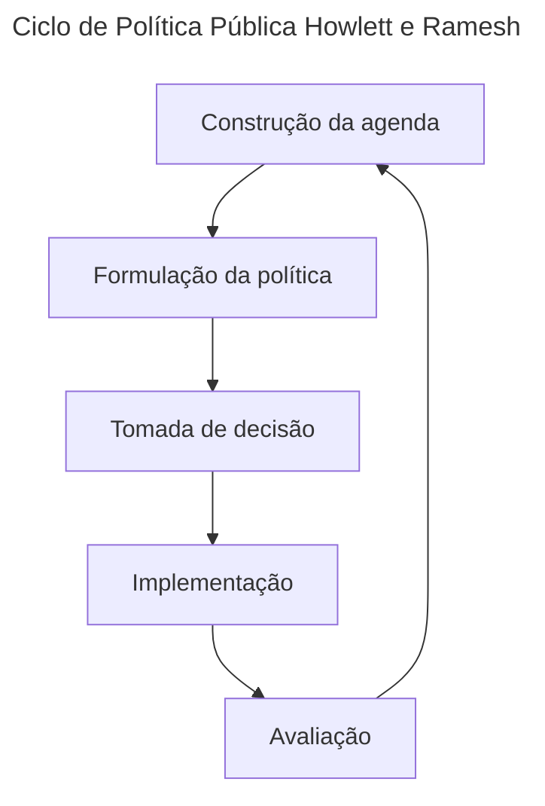

# Ciclo de Política Públicas

O ciclo de políticas pública é um esquema de visualização e interpretação que organiza a vida de uma política pública em fases. As fases podem ser sequenciais, interdependentes,
se misturarem, ficarem sobrepostas ou serem diferentes.

## Fase: Construção, formação, definição da agenda

A agenda consiste numa lista de temas ou problemas que são alvo de atenção em dado momento. Nessa fase busca-se identificar os **problemas coletivos** que podem ser resolvidos com
políticas públicas. O processo envolve diversos grupos de interesse que buscam que suas demandas sejam incluídas na agenda, especialmente incluídas como um problema e não como
situação. **Situação** é algo que não ocupa lugar prioritário na agenda, já um **problema** é algo que muito provavelmente terá prioridade na agenda. Portanto a construção da
agenda é um processo **competitivo**.

> O autor [Secchi](#secchi) divide o momento em que busca-se identificar o problemas coletivos da construção da agenda.

### Condições para um problema entrar na agenda

Para um problema entrar na agenda ele deve ter:

- **Atenção**: Diferentes atores (cidadãos, grupos de interesse, mídia e etc) devem entender a **situação como merecedora de intervenção**
- **Resolutividade**: As possíveis ações para resolver o problema devem ser consideradas **necessárias e factíveis**
- **Competência**: O problema deve estar relacionado a uma **responsabilidade pública**

## Formulação, análise de alternativas ou de políticas públicas

Esta fase visa estabelecer objetivos, desenvolvimento e seleção de alternativas para resolver um problema da agenda. Essa fase envolve o diagnóstico do problema, dos objetivos,
do público-alvo, dos atores institucionais envolvidos e formulação dos meios e instrumentos utilizados para resolver o problema a partir de definição de metas.

- O diagnóstico do problema: visa encontrar as causas do problema
- O diagnóstico dos objetivos: visa encontrar os objetivos da política pública
- O diagnóstico do público-alvo: visa encontrar os beneficiários da política pública
- O diagnóstico dos atores institucionais: visa encontrar e atribuir responsabilidade aos atores
- A formulação dos meios e instrumentos visa detalhar como será implementada a política pública

Na dinâmica da formulação há uma forte interação entre os formuladores e os impactados gerando três tipos de relação:

### Luta ou Conflito

Conflito entre os atores em um **jogo de soma zero**, ou sejam, alguém vai ganhar e alguém vai perder.

### Conciliação

Nessa relação os atores negociam e barganham com o objetivo de vencer sem necessariamente eliminar o outro.

### Debate

Os atores buscam convencer a outros atores na tentativa de transformá-lo em um aliado. É comum a utilização de técnicas de persuasão, trocas de favores ou ameaças.

### Modelos de formulação

#### Institucional Clássico

O modelo clássico é aquele que enfatiza o papel do estado. As instituições governamentais possuem padrões estruturados de comportamento de indivíduos e grupos com capacidade
de influenciar a formulação de política pública em razão dos interesses.

#### Neo Institucional

O modelo Neo Institucional é um **contraponto** ao modelo clássico. AS instituições não são visas como echos de forças sociais, mas uma arena de competição entre interesses rivais.
O atores políticos são dirigidos per deveres e a política é organizada em torno da construção e interpretação de significados (ao invés da criação de escolhas).
Significados que **não necessariamente vem da sociedade**.

#### Processual

Foca no processo político, viso como as atividades políticas são estruturadas sequencial e logicamente em fase de:

- identificação de situação-problema
- formulação de agenda
- legitimação
- implementação
- avaliação

#### Racional

A política pública resulta do **comprimento eficiente de metas racionalmente definidas**. Os cálculos sobre as relações custo e benefícios constituem os parâmetros para escolha
de alternativas mais eficientes (nível de satisfação ou insatisfação gerado para elevar valores social, político e economicamente demandados pela sociedade).

#### Sistêmica

A política pública é resultado da manifestação do sistema político para atender as necessidades e forças originadas na sociedade. As demandas (forças externas) são os _inputs_;
o sistema político representa o meio de processamento; a política pública representa o _output_ (resposta á sociedade).

### Grupos de interesse

É resultado da articulação organizada de indivíduos ou organizações com interesses convergentes, que utilizam a influência e o poder de pressão para impor ao estado a adoção de
medidas que os beneficiem.

## Tomada de decisão

Nessa fase os agentes politicos escolhem dentre as alternativas disponíveis, aquela alternativa que eles entendem ser a melhor solução.
Dependendo do ciclo de políticas públicas como [Saraiva](#saraiva) a tomada de decisão ocorre na fase de formulação.

### Modelos de tomada de decisão

#### Racional (compreensivo)

O responsável por tomar as decisões possui informações completas, capacidade plena para processá-las e compreender as consequências extras da decisão. Optam por políticas em que
os ganhos (benefícios) superem os custos, buscando alternativas eficientes, que maximizem os resultados. É de difícil aplicação em razão do detalhamento e da quantidade de
informações requeridas.

#### Incremental

Visa solucionar os problemas de maneira gradual, num processo de ajustamento mútuo entre parceiros, sem grandes modificações (conservador). A escolha de alternativas ocorre através
de comparação entre as alternativas, vencendo aquela que assegura o melhor acordo entre os interesses envolvidos. Pode gerar conflitos, negociações e compromisso dos decisores com
os próprios interesses. Normalmente envolve decisões mais urgentes e rápidas.

#### Sondagem mista

Surge em razão das deficiências do modelo racional puro (acredita ser a informação perfeita e desconsidera as relações de poder) e do modelo incremental (com viés conservador, sem
produzir grandes mudanças). O modelo é misto, com decisões incrementais e racionais-estruturantes. Os tomadores de decisão devem:

- Fazer uma ampla revisão do campo de decisão, para que as alternativas de longo prazo sejam examinadas, sem detalhamentos, levando a decisões estruturantes.
- analisar as alternativas específicas (que decorreram das decisões estruturantes) de forma mais detalhada, tomando uma decisão incremental.

#### Lata de lixo

Nesse modelo as soluções é que devem encontrar o problema. São construídas diversas soluções onde os agentes públicos buscam encontrar "problemas" que sejam resolvidos com essas
soluções. O modelo é utilizado quando existe um grande número de tomadores de decisão e uma grande dose de incerteza sobre as causas do problemas e suas soluções.

## Implementação

Nesta fase os planos e as decisões são colocados em prática e são produzidos os resultados concretos da política pública; as regras, rotinas e processo sociais são convertidos de
intenções em ações. A implementação compreende o conjunto dos eventos e atividades que acontecem após a definição das diretrizes de uma política, que incluem tanto os esforço para
administrá-la, como seus substantivos impactos sobre pessoas e eventos (Rua).

### Implementação (Saraiva)

O autor [Saraiva](#saraiva) entende que a execução é uma fase separada da implementação. Portanto implementação envolve a preparação, o planejamento e a organização do aparelho
administrativo, dos recursos humanos, financeiros, materiais e tecnológicos necessários para executar uma política, incluindo a elaboração dos planos, programas e projetos que
permitirão executá-la.

### Execução (Saraiva)

A fase da execução é um conjunto de ações destinadas a atingir os objetivos da política. É por em prática, é a sua realização e inclui o estudo dos obstáculos que se opõem á
transformação de enunciados em resultados, e especialmente, a análise da burocracia.

### Modelo de Implementação Top-Down

Há a separação entre o momento da tomada de decisão política e o momento de implementação. Trata=se de um processo linear de implementação no qual o momento da tomada de decisão
é considerado o mais importante. Burocratas a nível de rua não possuem poder decisório, cabendo a eles apenas executarem o a ordem que vem de cima.

> Exemplo de burocratas de rua são: professores, médicos, enfermeiros

### Modelo de Implementação Bottom-UP

Os implementadores (executores) de políticas públicas participam do processo e tem uma maior liberdade para decidirem sobre soluções durante a implementação. A legitimação dada
pelos tomadores de decisão dos altos escalões é feita após a práticas dos burocratas. É considerada mais flexível pois o formato que a política pública adquiriu após a tomada
de decisão não é definitivo, podendo ser modificável pelos implementadores no dia a dia.

> Alguns autores consideram que o burocrata é principal ator do modelo.

### Modelo de implementação híbrido

O modelo híbrido é caracterizado pela junção dos dois modelos top-down e bottom-up. Este modelo passou a ser muito utilizado na implementação das políticas públicas sobretudo,
depois da reforma do Estado, nos anos 90.

## Secchi

## Souza

## Saraiva

## Howlett e Ramesh

