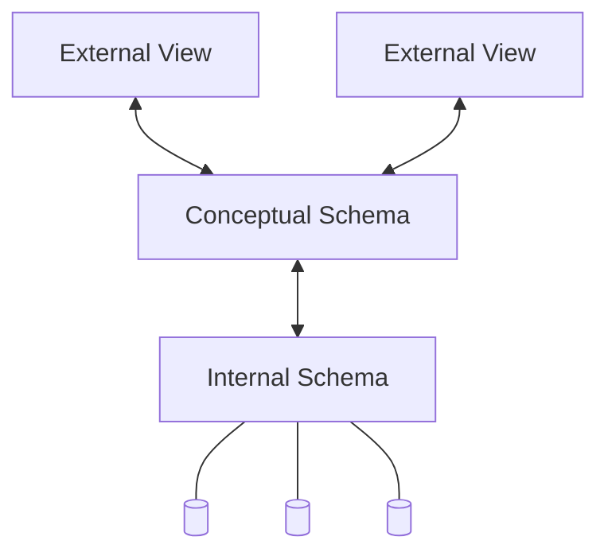

# Arquitetura de três esquemas e Independência de dados

## Arquitetura de três esquemas

Duramente o desenvolvimento e implementação de um banco de dados relacional se é utilizados uma arquitetura de **três** camadas: ***External View***,***Conceptual schema***,
***Internal schema***.

Internal schema, em tradução livre esquema interno, possui a responsabilidade de realizar o armazenamento físico dos dados, contendo todos os detalhes de
onde os dados estão armazenados e podendo utilizar informações do hardware para otimizar leitura e escrita dos dados.

Conceptual schema, ou **nível lógico**, é a camada responsável pela representação lógica do banco de dados como: relacionamentos, entidades, operações dos usuário, tipos dos dados e
suas restrições. **O nível lógico não deverá conter informações sobre o dispositivo ou o local onde os dados serão armazenados.**

External view, ou visão de aplicação é a camada responsável por tornar visível parte do banco de dados para uma aplicação ou um grupo de aplicações. É nessa camada que ficam os
detalhes de acesso ao banco, APIs que possibilitam a leitura, procura e escrita no banco.

## Independência de dados

Dizemos que uma implementação de banco de dados possui uma **alta independência no nível lógico** quando é possível modificar as entidades, operações dos usuários, ou restrições nos
dados sem a necessidade de realizar modificações em aplicações que utilizam o banco. 

Dizemos que uma implementação de banco de dados possui uma **alta independência no nível físico** quando podemos modificar o schema interno sem a necessidade de modificações tanto
no nível lógico quando no externo.
