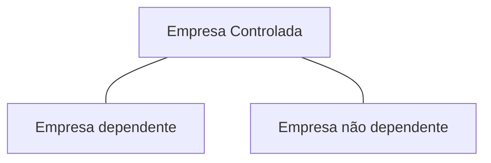

## Princípios da Lei de responsabilidade Fiscal

- Planejamento
  - Objetivos
  - Ações
  - Meios disponíveis
- Transparência
  - Publicidade
  - Prestação de contas
- Responsabilização
  - Accountability
  - Prestação de contas
- Controle
  - Fiscalização
  - Controle legal, técnico e de gestão

## Objetivos

Estabelecer normas de finanças públicas voltadas para a responsabilidade na gestão fiscal.

**Ação planejada**: Planejamento nas formas de leis, a fim e que seja submetida á apreciação legislativa;

**Ação transparente:** Todos os atos de entidades públicas devem ser praticados com publicidade e com ampla prestação de contas em diversos meios;

**Prevenção de riscos capazes de afetar o equilíbrio das contas públicas:** precaução em condições de incerteza, atribuindo maior confiabilidade ao planejamento e prevenindo
os desequilíbrios ( reserva de contingência na LOA e previsão de um anexo de riscos fiscais na LDO)

**Correção de desvios capazes de after o equilíbrio das contas públicas:** parâmetros que permitam comparação e e identificação de desvios.

**Comprimento de metas de resultados entre receitas e despesas e á obediência a limites e condições no que tange a renúncia de receita,geração de despesas com pessoal,
da seguridade social e outras, dívidas consolidada e mobiliária, operações de crédito, inclusive por antecipação de receita, concessão de garantia e inscrição em Restos
a Pagar**: Tópicos destacado la LRF visando também o equilíbrio das contas públicas

## Abrangência

As disposições dessa lei complementar obrigam a **União** , os **Estados** , o **Distrito Federal** e os **municípios** .

<!-- > [!INFO] -->

> Portanto é uma **Abrangência Nacional**

- á União, ao distrito federal e aos município, estão compreendidos:
  - O poder Executivo, o Poder Legislativo, neste abrangidos os Tribunais de Contras, o Poder Judiciário e o Ministério Público
- as respectivas administrações diretas, fundos, autarquias, fundações e empresas **estatais dependentes**
- A Estados entende-se considerado o Distrito Federal
- a Tribunais de Contras estão incluídos: Tribunal de Conas da União, Tribunal de Contas do Estado e quando houver, Tribunal de Contas dos Municípios e
  Tribunal de Contas do Município[^TCM-e-TCMs]

## Conceitos

Para efeitos dessa lei entende-se como:

1. Ente da federação:a **União**, **cada Estado**, **O distrito Federal** e cada **Município**
2. Empresa Estado dependente: é uma empresa controlada [^Empresa-controlada] que receba do ente controlador recursos financeiros para pagamento de despesas com pessoal ou de custeio
   em geral ou de capital, excluídos, no último caso, aqueles provenientes de aumento de participação acionária

## Receita corrente Líquida

Receita corrente líquida: Somatório das receitas tribuárias, de contribuições, patrimoniais, industriais, agropecuárias, de serviços, transferências correntes e outras receitas
também correntes, **deduzidos**:

- na União, os valores transferidos aos Estados e municípios por determinação constitucional ou legal, e as contribuições mencionadas na alínea a do
  [inciso 1, inciso 2 do Art. 195][art 195] no [Art. 239 da constituição][art 236]

- nos Estados, as parcelas entregues aos municípios por determinação constitucional

- na União, nos Estados e nos Municípios, a contribuição dos servidores para o custeio do seu sistema de previdência e assistência social e as receitas provenientes da compensação
  financeira citada no [inciso 9 art 201 da constituição][art 201]

[art 201]: https://www.planalto.gov.br/ccivil_03/constituicao/Constituicao.htm#art201.0
[art 236]: https://www.planalto.gov.br/ccivil_03/constituicao/Constituicao.htm#art239.0
[art 195]: https://www.planalto.gov.br/ccivil_03/constituicao/Constituicao.htm#art195

## Diretrizes orçamentárias

A lei de responsabilidade fiscal disporá sobre:

- **Equilíbrio** entre receitas e despesas
- **critério e forma de limitação de empenho** a ser efetivada nas hipóteses previstas nesta lei
- **normas** relativas ao **controle de custos e á avaliação dos resultados** do programas financiados com recursos dos orçamentos;
- **Condições e exigências** para transferência de recursos a entidades públicas e privadas

### Anexos de Metas Fiscais

Integrará o projeto de lei de diretrizes orçamentárias **Anexo de Metas Fiscais** em que serão estabelecidas metas anuais, em valores correntes e constantes,
relativas a:

- Receitas
- Despesas
- Resultado nominal
- **Resultado primário**
- Montante da dívida pública

O anexo conterá:

1. **avaliação** do comprimento das metas relativas ao ano anterior;
2. demonstrativo das metas anuais, instruído com memória e metodologia de cálculo que justifiquem os resultados pretendidos, comparando-as com as fixadas nos
   **três exercícios anteriores**, e evidenciando a consistência delas com as premissas e os objetivos da política econômica nacional;
3. evolução do patrimônio líquido, também nos últimos três exercícios, destacando a origem e a aplicação dos recursos obtidos com a alienação de ativos;
4. Avaliação da situação financeira e atual:
   - dos regimes geral de previdência social e próprio dos servidores público e do Fundo de Amparo ao Trabalhador
   - dos demais fundos públicos e programas estatais de natureza atuarial
5. Demonstrativo de estimativa e compensação de renúncia de receita e da margem de expansão das despesas obrigatórias de caráter continuado.

   > O demonstrativo de estimativa está no anexo de Metas fiscais, mas as **medidas de compensação** não, as medidas estão no planejamento da Lei orçamentária anual (LOA)

6. Quadro demonstrativo do **cálculo da meta do resultado primário** de que trata o primeiro parágrafo do primeiro desse artigo, que evidencie os principais agregados de receitas
   e despesas, os resultados, **comparando-os com os valores programados** para o exercício em curso e os realizados nos **dois exercícios anteriores**. e as estimativas para o
   exercício a que se refere a lei de diretrizes orçamentárias e para os subsequentes.

## Anexos de Riscos

A Lei de diretrizes orçamentárias (LDO) conterá Anexo de Riscos Fiscais, onde serão avaliados os passivos contingentes e outros riscos capazes de afetar as contas públicas, informando
as providências a serem tomadas, caso se concretizem.

- Riscos Fiscais Orçamentários: Queda da receita e aumento da despesa

- Riscos Fiscais da Divida: Juros, Taxa Cambial, inflação

- Passivos Contingentes: Eventos futuros e incertos

## Anexos Específico da União

A mensagem que encaminhar o projeto da união apresentará, em **anexo específico**, os **objetivos das políticas monetária[^Policia-monetaria], creditícia[^Politica-crediticia]
e cambial[^Politica-cambial]**, bem como os parâmetros e as projeções para seus principais agregados e variáveis, e ainda as **metas de inflação**, para o exercício subsequente.

> **Metas de inflação está no anexo específico da União**

**No caso da União** o Anexo de Metas Fiscais do projeto de (LDO) conterá também:

1. as metas anuais **para o exercício a que se referir e para os três seguintes** como o objetivo de garantir sustentabilidade á trajetória da dívida pública
2. A Lei de diretrizes orçamentárias estabelecera as diretrizes de política fiscal e as respectivas metas anuais de resultado primário do Governo Central para o exercício
   a que se referir e **para os 3 (três) seguintes, compatíveis com a trajetória sustentável da dívida pública**.
   1. Considerar-se **compatível com a sustentabilidade da dívida pública** o estabelecimento de metas de resultados primários, nos termos das leis de diretrizes orçamentárias,
      **até a estabilização da relação entre Dívida Bruta do Governo Geral (DBGG) e o produto interno bruto (PIB)**, conforme o Anexo de Metas Fiscais de que trata o inciso 5
      do art 4 da Lei de Responsabilidade Fiscal
   2. o **marco fiscal de médio prazo** com projeções para os principais agregados fiscais que compõem os cenários de referência, distinguindo-se as despesas primárias das
      financeiras e as obrigatórias daquelas discricionárias
   3. o efeito esperado e a compatibilidade, no período de 10 (dez) anos do comprimento da dívida pública, **evidenciando o nível de resultados fiscais consistentes
      com a estabilização da Dívida Bruta do Governo Geral (DBGG) em relação ao Produto Interno Bruto (PIB)**
   4. os **intervalos de tolerância** para verificação do comprimento das metas anuais de resultado primário, convertido em valores correntes, de **menos de 0,25 p.p**  
      (vinte e cinco centésimos ponto percentual) e de **mais 0,25 p.p** do PIB previsto no respectivo projeto de lei de diretrizes orçamentárias;
   5. os **limites e os parâmetros** orçamentários dos **Poderes e órgãos autônomos** compatíveis com as disposições estabelecidas na lei complementar prevista no inciso
      8 do caput do art 163 da Constituição Federal e no art 6 da Emenda Constitucional número 126 de 21 de dezembro de 2022;
   6. a estimativa do impacto fiscal, quando couber, das recomendações resultantes da avaliação das políticas públicas previstas no inciso 16 do art. 37 da constituição Federal

## Outras Atribuições da LDO de Acordo com a LRF

- Conter **autorização** para que os municípios contribuam para o custeio de despesas de competência de outros entes da Federação
- Estabelecer **exigências** para a relação de transferência voluntária
- Estabelecer **condições** para a destinação de recursos para, direta ou indiretamente, cobrir necessidades de pessoas físicas ou déficits de pessoas jurídicas
- Dispor sobre programação financeira e o cronograma de execução mensal do desembolso estabelecido pelo Poder Executivo até 30 dias após a publicação do orçamentos
  (Art. 8 da LRF)
- Estabelecer para os Poderes e o Ministério Público **critérios de limitação de empenho e movimentação financeira**
  se verificado, ao final de um bimestre, que a realização da receita
  poderá não comportar o cumprimento das metas de resultado primário ou nominal estabelecidas no Anexo de Metas Fiscais.
- Ressalvar as despesas que não serão submetidas a limitação de empenho
- Dispor sobre a **concessão ou ampliação de incentivo ou benefício de natureza tributária** da qual decorra **renúncia de receita**
- Forma de utilização e o montante da reserva de contingência

## Observações

[^TCM-e-TCMs]: Tribunais de Contas **do Município** só tem jurisdição sobre o município específico. Já Tribunais de contras **dos municípios** tem jurisdição sobre os municípios do estado

[^Empresa-controlada]: empresa controlada: sociedade cuja maioria do capital social **com direto a voto** pertença, direta ou indiretamente, a ente da federação

[^Policia-monetaria]:
    Alcance pelo Banco Central do Brasil, da **meta de inflação** fixada pelo conselho Monetário Nacional de 4.5% com intervalo de tolerância de mais ou menos
    2 pontos percentuais

[^Politica-crediticia]:
    Manutenção das **condições prudenciais e regulamentares** para que a expansão do **mercado de crédito** ocorro em ambiente que preserve a **estabilidade**
    **do sistema financeiro nacional**

[^Politica-cambial]: **Preservação** do regime de **taxa de câmbio flutuante**

