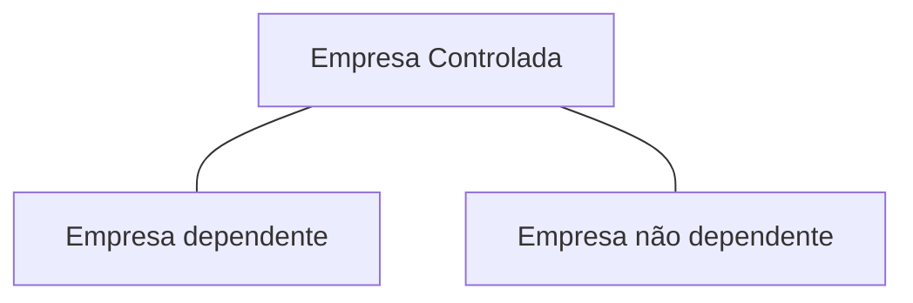

## Princípios da Lei de responsabilidade Fiscal

- Planejamento
  - Objetivos
  - Ações
  - Meios disponíveis
- Transparência
  - Publicidade
  - Prestação de contas
- Responsabilização
  - Accountability
  - Prestação de contas
- Controle
  - Fiscalização
  - Controle legal, técnico e de gestão

## Objetivos

Estabelecer normas de finanças públicas voltadas para a responsabilidade na gestão fiscal.

**Ação planejada**: Planejamento nas formas de leis, a fim e que seja submetida á apreciação legislativa;

**Ação transparente:** Todos os atos de entidades públicas devem ser praticados com publicidade e com ampla prestação de contas em diversos meios;

**Prevenção de riscos capazes de afetar o equilíbrio das contas públicas:** precaução em condições de incerteza, atribuindo maior confiabilidade ao planejamento e prevenindo
os desequilíbrios ( reserva de contingência na LOA e previsão de um anexo de riscos fiscais na LDO)

**Correção de desvios capazes de after o equilíbrio das contas públicas:** parâmetros que permitam comparação e e identificação de desvios.

**Comprimento de metas de resultados entre receitas e despesas e á obediência a limites e condições no que tange a renúncia de receita,geração de despesas com pessoal,
da seguridade social e outras, dívidas consolidada e mobiliária, operações de crédito, inclusive por antecipação de receita, concessão de garantia e inscrição em Restos
a Pagar**: Tópicos destacado la LRF visando também o equilíbrio das contas públicas

## Abrangência

As disposições dessa lei complementar obrigam a **União** , os **Estados** , o **Distrito Federal** e os **municípios** .

<!-- > [!INFO] -->

> Portanto é uma **Abrangência Nacional**

- á União, ao distrito federal e aos município, estão compreendidos:
  - O poder Executivo, o Poder Legislativo, neste abrangidos os Tribunais de Contras, o Poder Judiciário e o Ministério Público
- as respectivas administrações diretas, fundos, autarquias, fundações e empresas **estatais dependentes**
- A Estados entende-se considerado o Distrito Federal
- a Tribunais de Contras estão incluídos: Tribunal de Conas da União, Tribunal de Contas do Estado e quando houver, Tribunal de Contas dos Municípios e
  Tribunal de Contas do Município[^TCM-e-TCMs]

## Conceitos

Para efeitos dessa lei entende-se como:

1. Ente da federação:a **União**, **cada Estado**, **O distrito Federal** e cada **Município**
2. Empresa Estado dependente: é uma empresa controlada [^Empresa-controlada] que receba do ente controlador recursos financeiros para pagamento de despesas com pessoal ou de custeio
   em geral ou de capital, excluídos, no último caso, aqueles provenientes de aumento de participação acionária

## Observações

[^TCM-e-TCMs]: Tribunais de Contas **do Município** só tem jurisdição sobre o município específico. Já Tribunais de contras **dos municípios** tem jurisdição sobre os municípios do estado

[^Empresa-controlada]: empresa controlada: sociedade cuja maioria do capital social **com direto a voto** pertença, direta ou indiretamente, a ente da federação

## Receita corrente Líquida

Receita corrente líquida: Somatório das receitas tribuárias, de contribuições, patrimoniais, industriais, agropecuárias, de serviços, transferências correntes e outras receitas
também correntes, **deduzidos**:

- na União, os valores transferidos aos Estados e municípios por determinação constitucional ou legal, e as contribuições mencionadas na alínea a do
  [inciso 1, inciso 2 do Art. 195][art 195] no [Art. 239 da constituição][art 236]

- nos Estados, as parcelas entregues aos municípios por determinação constitucional

- na União, nos Estados e nos Municípios, a contribuição dos servidores para o custeio do seu sistema de previdência e assistência social e as receitas provenientes da compensação
  financeira citada no [inciso 9 art 201 da constituição][art 201]

[art 201]: www.planalto.gov.br/ccivil_03/constituicao/Constituicao.htm#art201.0
[art 236]: https://www.planalto.gov.br/ccivil_03/constituicao/Constituicao.htm#art239.0
[art 195]: https://www.planalto.gov.br/ccivil_03/constituicao/Constituicao.htm#art195

## Diretrizes orçamentárias

A lei de responsabilidade fiscal disporá sobre:

- **Equilíbrio** entre receitas e despesas
- **critério e forma de limitação de empenho** a ser efetivada nas hipóteses previstas nesta lei
- **normas** relativas ao **controle de custos e á avaliação dos resultados** do programas financiados com recursos dos orçamentos;
- **Condições e exigências** para transferência de recursos a entidades públicas e privadas

### Anexos de Metas Fiscais

Integrará o projeto de lei de diretrizes orçamentárias **Anexo de Metas Fiscais** em que serão estabelecidas metas anuais, em valores correntes e constantes,
relativas a:

- Receitas
- Despesas
- Resultado nominal
- Resultado primário
- Montante da dívida pública

O anexo conterá:

1. **avaliação** do comprimento das metas relativas ao ano anterior;
2. demonstrativo das metas anuais, instruído com memória e metodologia de cálculo que justifiquem os resultados pretendidos, comparando-as com as fixadas nos
   **três exercícios anteriores**, e evidenciando a consistência delas com as premissas e os objetivos da política econômica nacional;
3. evolução do patrimônio líquido, também nos últimos três exercícios, destacando a origem e a aplicação dos recursos obtidos com a alienação de ativos;
