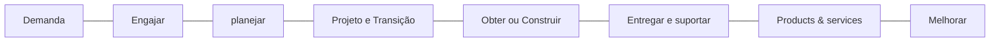

## Cadeia de Valor de Serviço (Service Value Chain)

- A cadeia de valor de serviço é o elemento central do sistema de Valor de Serviço

- Mostra as atividades-chave necessárias para atender á demanda e criar valor por meio
do gerenciamento de produtos ?

- São 6 atividades chave:
  
  1. Engajar
  2. Planejar
  3. Projeto e Transição
  4. Obter ou Construir
  5. Entregar e Suportar
  6. melhorar

### Engajar

Prover entendimento sobre as necessidades
dos _stakeholders_, transparência e bom
relacionamento com as partes interessadas

## Planejar

Garantir entendimento da visão, estado atual
e **direcionamento para produtos e serviços da organização**

## Projeto e Transição

Garantir que as especificações (projeto / arquitetura)  de produtos e serviços atendem
ás expectativas de qualidade, custo e prazos

## Projeto e transição

Garantir que as especificações (projeto / arquitetura) de produtos e serviços atendem
ás expectativas de qualidade, custo e prazos

## Obter ou Construir

Produzir os componentes dos serviços, desenvolver software, adquirir infraestrutura,
montar arquitetura de rede

## Entregar e Suportar

Garantir que os serviços estão sendo entregues aos usuários
de acordo com os níveis acordados (atendimento e suporte)

## Melhorar

Garantir a **melhoria continua dos serviços** e descobrir
oportunidades para aperfeiçoamento pro meio de medições
