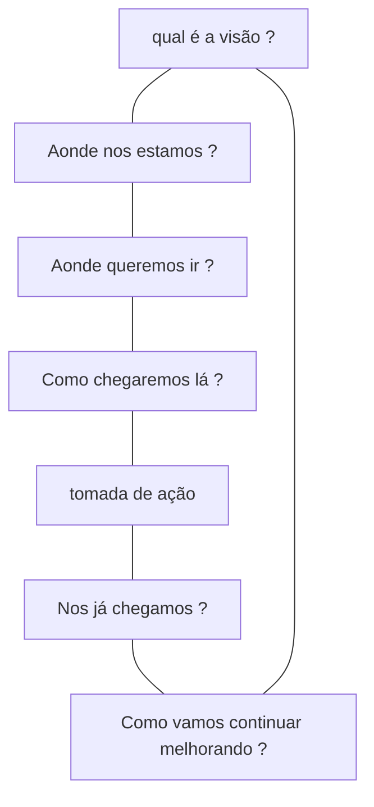

# Elemento de Melhoria Continua

Melhoria continua acontece em todas as áreas da organização e em todos os níveis

- aplica-se a todos os produtos, serviços, componentes de serviços e relacionamentos
O elemento de melhoria continua inclui
- O modelo de melhoria continua
- A atividade de "melhorar" da cadeia de valor
- a prática de melhoria continua

## Modelo de melhoria continua

### Qual é a visão ?

Visão, missão da empresa, objetivos e metas

### Onde nos estamos

Realize testes, avaliações para entender como a organização está, suas fraquezas
e qualidades

### Aonde queremos ir ?

Defina objetivos, metas, indicadores mensuráveis

### Como chegaremos lá

Defina um plano de aprimoramento

### Tomada de Ação

Realize ações que buscam aprimorar

### Nos já chegamos ?

Analise, avalie as ações tomadas e indicadores chaves
